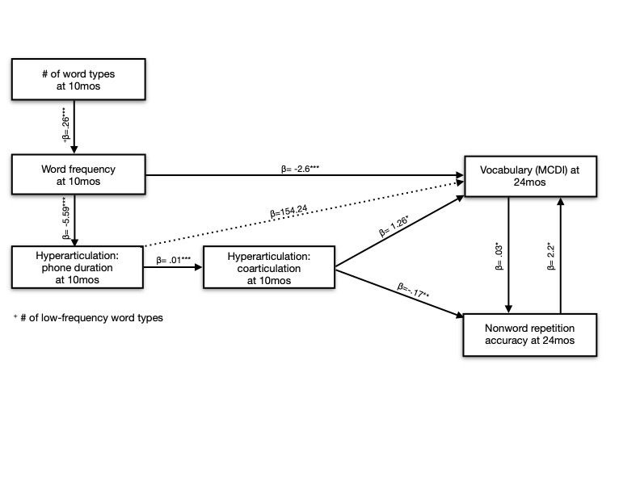
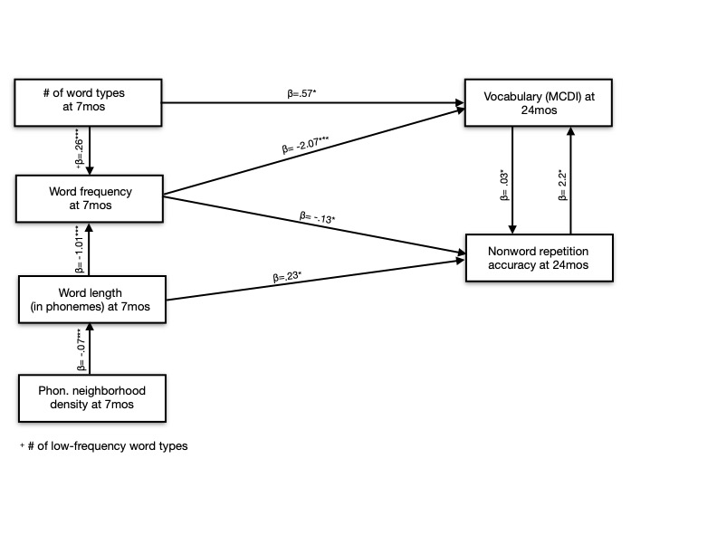

```{r setup, echo=FALSE}
knitr::opts_chunk$set(echo = FALSE,
                      warning = FALSE,
                      message=FALSE)
```

```{r, packages}
library('dplyr')
library('tidyr')
library('ggplot2')
library('broom')
library('kableExtra')
library('gridExtra')
library('stargazer')
library('knitr')
library('grid')
library('lmerTest')
library('emmeans')
```

```{r, load data}
# load children's nwr scores
nwr_data <- read.csv('/Users/megcychosz/Box/CDS_nonword/analysis/data/NWR_stats.csv') %>%
  mutate(child_ID = X,
         child_ID = recode(child_ID, "5244SE"="5244", "5837JK"="5837")) %>%
  select(adj_NW_acc, child_ID) # 86 children completed NWR

# load children's vocabulary scores at 7, 10, 11, and 24 months and demographic data
vocab_data1 <- read.csv('/Users/megcychosz/Box/CDS_nonword/analysis/data/nwr_part_demographics.csv') %>%
  mutate(child_ID = Participant.ID,
         child_ID = recode(child_ID, "5244SE"="5244", "5837JK"="5837"),
         Gender = recode(Gender, "male "="male"),
         Maternal.Ed = recode(Maternal.Ed, "college "="college")) %>%
  select(child_ID, Gender, Maternal.Ed, MCDI..7.months_visit1_understands, MCDI..10.11.mos_visit2_understands, MCDI..10.11.mos_visit3_understands, MCDI_visit4_raw, MCDI..raw_visit5, PPVT.raw_visit5, EOW.SS_visit5) %>% # we have vocab scores from 85 children (not ID 6785)
  filter(child_ID!='6785')

# load children's ages
age_data <- read.csv('/Users/megcychosz/Box/CDS_nonword/analysis/data/child_birthdates_84.csv') %>% # only contains the correct 84 children 
  select(child_ID, age.at.7mos.totaldays,age.at.10mos.totaldays,age.at.11mos.totaldays,age.at.18mos.totaldays,age.2year.visit.totaldays)
  
# load children's race/ethnicity and birth order information
vocab_data <- read.csv('/Users/megcychosz/Box/CDS_nonword/analysis/data/ethnicity_data.csv') %>%
  filter(Participant!='5244RE' & Participant!='5837AK') %>%
  mutate(child_ID = substr(Participant,1,4)) %>%
  select(Race.Ethnicity, Birth.Order, child_ID) %>%
  merge(., vocab_data1, by="child_ID", all.y=T) 


# load lexical lists; type and token counts and ratios
data <- read.csv('/Users/megcychosz/Box/CDS_nonword/data/stat.frq.csv') %>%
  mutate(File=gsub("\\,.*","",File)) %>%
  mutate(File=recode(File, "4708IB24mosChild2"="4708IB24mosChild")) %>% # we have transcripts from 85 kids (not 7643)
  filter(File!='6785KS7mosChild'&File!='6785KS24mosChild'&File!='6785KS10mosChild')# this child doesn't have vocab data at 18 or 24 mos

# load acoustic measures 
acoustic_data <- read.csv('/Users/megcychosz/Box/CDS_nonword/analysis/data/acoustic_measures.csv') %>%
  rename(File=Speaker,
         mean_euc_dist = final_euc_dist,
         word=Word) %>%
  select(-X) %>%
  filter(File!='6785KS7mosChild'&File!='6785KS24mosChild'&File!='6785KS10mosChild') %>% # this child doesn't have vocab data at 18 or 24 mos
 filter(File!='5733LE24mosChild'&File!='6510LC11mosChild') # these children had a really short recording 

iphod_dict <- read.csv('/Users/megcychosz/Box/CDS_nonword/analysis/results/IPhOD2_Words.csv') %>%
  rename(word=Word) %>%
  select(word, strBPAV, NPhon, SFreq, strDENS)  # select phon. probability and PND calculations unweighted for frequency, but                             
                                                          #distinguish between stressed and unstressed vowels
                                                             # also select NPhonemes, PND, & SUBTLEX word frequency
```

```{r, get the word types from each speaker, at each time point}
pre_wd_types <- data %>%
  group_by(File) %>%
  select(-Language, -Corpus, -Code, -Age, -Sex, -Group, -Race, 
         -SES, -Role, -Education, -Custom.field, -òh, -X.MOT, 
         -X.MOT., -X.ahhah, -.., -A.man.v) %>%
  relocate(Types, Token, TTR, MATTR, File) %>% # move type count, token count, ttr, and mattr to front of df
  gather("word", "count", 6:ncol(.)) %>%
  filter(count!='0') %>% # remove words that don't appear within individual corpora
  mutate(word=tolower(word)) %>% # convert all word entries to lowercase to facilitate matching 
  group_by(word) %>%
  add_count() %>%
  mutate(File=recode(File, "5244se18mosChild"="5244SE18mosChild")) %>%
  filter(File!='5733LE24mosChild') %>% # this transcript was only ~ 2 minutes long
  filter(File!='6510LC11mosChild') # really short recording 
```

```{r, participant demographc stats, eval=FALSE}
# we have transcripts, NWR, and vocab from n=84 children
# a subset of those children contributed acoustic data, which will be reported in the paper
# the demographics for the n=84 children are as follows

eighty_four <- pre_wd_types %>% # contains dmeographic info
  ungroup() %>%
  mutate(child_ID=substr(File,1,4)) %>%
  distinct(child_ID) %>%
  merge(., vocab_data, by="child_ID") # this removes the kid w/o transcripts
 
# gender distribution
gen_dist <- eighty_four %>%
  count(Gender) # 49 female, 35 male 

# mat ed
mat_ed_dist <- eighty_four %>%
  count(Maternal.Ed) # 1 no response, 4 some college/associate's, 30 college, 49 post-graduate

# race/ethnicity
race_dist <- eighty_four %>%
  count(Race.Ethnicity)

# num of first born 
birth_order <- eighty_four %>%
  count(Birth.Order) %>%
  mutate(order_percen =  (n/ 84)*100)
```

```{r, stats about recordings with lexical measures by timepoint}
recording_stats <- pre_wd_types %>%
  mutate(child_ID=substr(File,1,4)) %>%
  mutate(tpt=substring(File, 7, 11),
         tpt=recode(tpt, 'I7mos'='7mosC', "I10mo"="10mos", "I18mo"="18mos","I24mo"="24mos")) %>%
  ungroup() %>%
  filter(child_ID!='6785') # remove the kid w/o vocab measures

# how many children do we have recordings from? (from at least one timepoint)
n_recordings <- recording_stats %>%
  distinct(child_ID) %>%
  count() # 84

# how many children completed recordings at tp1
tp1_cts <- recording_stats %>% 
  filter(tpt=='7mosC') %>% 
  distinct(File) %>%
  count() # 82

# how many children completed recordings at tp2 (10 or 11)
tp2_cts <- recording_stats %>% 
  filter(tpt=='10mos'|tpt=='11mos') %>% 
  distinct(File) %>%
  count() # 83

# how many children completed recordings at 10mo?
ten_mo_cts <- recording_stats %>% 
  filter(tpt=='10mos') %>% 
  distinct(File) %>%
  count() # 56

# how many children completed recordings at 11mo?
eleven_mo_cts <- recording_stats %>% 
  filter(tpt=='11mos') %>% 
  distinct(File) %>%
  count() # 27

# how many children completed recordings at tp3
tp3_cts <- recording_stats %>% 
  filter(tpt=='18mos') %>% 
  distinct(File) %>%
  count() # 40

# how many children completed recordings at tp4
tp4_cts <- recording_stats %>% 
  filter(tpt=='24mos') %>% 
  distinct(File) %>%
  count() # 83

# how many children completed recordings at all 4 timepoints? 
all_tpts <- recording_stats %>%
  distinct(File, .keep_all = T) %>%
  group_by(child_ID) %>%
  count() %>%
  filter(n=='4') %>%
  NROW() # 39 

# how many children completed recordings at all 3 of the major timepoints (7, 10, 24)? 
three_tpts <- recording_stats %>%
  distinct(File, .keep_all = T) %>%
  filter(tpt!='18mos') %>%
  group_by(child_ID) %>%
  count() %>%
  filter(n=='3') %>%
  NROW() # 82
```

```{r, create age table, echo=F}
# number of transcripts 
transcript_tbl <- recording_stats %>% 
  mutate(tpt=recode(tpt,"11mos"="10mos")) %>%
  group_by(tpt) %>% 
  distinct(File) %>%
  count(name="lexical_transcripts") 

# percentage of transcripts suitable for coartic analysis 
coartic_tbl <- recording_stats %>%
   filter(File!='5440JJ7mosChild' & File!='5440JJ11mosChild') %>%
   mutate(tpt=recode(tpt,"11mos"="10mos")) %>%
   group_by(tpt) %>% 
   distinct(File) %>%
   count(name="coartic_transcripts") %>%
   merge(., transcript_tbl, by="tpt")
 
 # percentage of transcripts suitable for vocalic analysis 
final_transcript_tbl <- recording_stats %>%
   filter(File!="7075MB7mosChild" & 
    File!="5609DW7mosChild" & 
    File!="4814BS10mosChild" &
    File!="5440JJ11mosChild" &
    File!="5440JJ7mosChild" &
   File!="6206MP24mosChild" &
   File!="5936SR7mosChild" &
   File!="6206MP10mosChild" &
   File!="5540LD7mosChild" &
   File!="5550VS7mosChild" &
   File!="6337NK11mosChild" &
   File!="6453HS10mosChild" &
   File!="7553JT7mosChild")  %>%
   mutate(tpt=recode(tpt,"11mos"="10mos")) %>%
   group_by(tpt) %>%
   distinct(File) %>%
   count(name="vowel_transcripts") %>%
   merge(., coartic_tbl, by="tpt") %>%
  mutate(tpt=recode(tpt, "10mos"="stats_10mos","18mos"="stats_18mos", "7mosC"="stats_7mos","24mos"="stats_24mos")) %>%
  mutate(percen_coartic=paste(coartic_transcripts,"(",round(coartic_transcripts/lexical_transcripts*100,2),")"),
         percen_vowel=paste(vowel_transcripts,"(",round(vowel_transcripts/lexical_transcripts*100,2),")")) %>%
  select(-vowel_transcripts, -coartic_transcripts) %>%
  t(.) %>%
  janitor::row_to_names(1)

age_tbl_724 <- age_data %>%
  mutate(age.at.7mos = age.at.7mos.totaldays / 30,
         age.at.18mos = age.at.18mos.totaldays / 30,
         age.2year.visit = age.2year.visit.totaldays / 30) %>%
  summarize(stats_7mos = paste(round(mean(age.at.7mos),2),"(",round(sd(age.at.7mos),2),")",
            round(min(age.at.7mos),2),"-",round(max(age.at.7mos),2)),

            stats_18mos = paste(round(mean(age.at.18mos, na.rm = T),2),"(",round(sd(age.at.18mos, na.rm = T),2),")",
            round(min(age.at.18mos, na.rm = T),2),"-",round(max(age.at.18mos, na.rm = T),2)),

            stats_24mos = paste(round(mean(age.2year.visit),2),"(",round(sd(age.2year.visit),2),")",
            round(min(age.2year.visit),2),"-",round(max(age.2year.visit),2)))

# calculate the 10-11 month stats separately because recordings came from approx. half of 
# dyads at 10 months and half at 11 months

# first get data for children who completed measures at 10 months versus 11 months
ten_age_data <- recording_stats %>%
  filter(tpt=='10mos') %>%
  distinct(File, .keep_all = T) %>% 
  merge(., age_data, by='child_ID') %>% # list of only kids analyzed at 10mos (m=56) (56/83)
  select(child_ID, age.at.10mos.totaldays)

ten_eleven_age_data <- recording_stats %>%
  filter(tpt=='11mos') %>%
  distinct(File, .keep_all = T) %>%
  merge(., age_data, by='child_ID') %>% # list of only kids analyzed at 11mos (n=27) (27/53)
  select(child_ID, age.at.11mos.totaldays) %>%
  rename(age.at.10mos.totaldays = age.at.11mos.totaldays) %>%
  rbind(., ten_age_data)

final_age_tbl <- ten_eleven_age_data %>%
  mutate(age.at.10mos = age.at.10mos.totaldays / 30) %>%
 summarize(stats_10mos = paste(round(mean(age.at.10mos),2),"(",round(sd(age.at.10mos),2),")",
            round(min(age.at.10mos),2),"-",round(max(age.at.10mos),2))) %>%
  cbind(., age_tbl_724) %>%
  relocate(stats_7mos) %>%
  rbind(., final_transcript_tbl)

row.names(final_age_tbl) = c('Child age (months): mean (SD) range', '# of transcribed play sessions', '# and % analyzed for coarticulation', '# and % analyzed for vowels')
```

```{r, write out age table}
knitr::kable(final_age_tbl, caption = 'Child age and mother-child play session statistics', 
             booktabs=T,
             col.names = c( "7mos", "10-11mos", "18mos", "24mos")) %>%
  kable_styling() %>% 
  landscape()
```

```{r, cleaning the data, cache=TRUE}
# some cleaning
wd_typesa <- pre_wd_types %>%
  mutate(word=recode(word, "trip.v"="tripp", "coop.v"="coopp", "getchu.o"="getchu_o", "gold.fish"="gold_fish",
                     "it.s"="its")) %>% # clean up a mess
  mutate(word = strsplit(word, "\\.s")[1], # convert genitive forms to base form
         word=as.character(word)) %>%
  mutate(word = strsplit(word, "\\.v")[1],
         word=as.character(word))  %>%
  group_by(File,word) %>% 
  mutate(count=sum(count), # now add the counts of those word forms together
         n=sum(n)) %>%
  ungroup() %>%
  unique() %>%
  filter(!grepl("\\.o", word)) %>%# remove all onomatopoeia 
  filter(!grepl('"', word)) # remove all weird orthography 

# removing words
wd_typesb <- wd_typesa %>% 
  mutate(word=recode(word, "horsy"="horsey", "aught"="ought", "omelette"="omelet", "mousey"="mousy", "lightening"="lightning")) %>%
      filter(word!='alison' & word!='alexander' & word !='ally' # remove erroneous words, proper names, etc.
         & word!='amelia' & word!='anna' & word!='ar' & word!='asher' & word!='ava' & word!='aidan'
         & word!='b' & word!='baxter' & word!='billy' & word!='bob' & word!='bobby' & word!='caroline'
         & word!='charlie' & word!='chico' & word!='chloe' & word!='claire' & word!='colin' & word!='coopp'
         & word!='d' & word!='dan' & word!='daniel' & word!='dave' & word!='david' & word!='de'
         & word!='dean' & word!='devon' & word!='doo' & word!='dorothy' & word!='eh' & word!='eli' & word!='gabby' & word!='dean'
          & word!='emily' & word!='emma' & word!='erin' & word!='eve' & word!='francis' & word!='fred'& word!='collin'
          & word!='gabby' & word!='george' & word!='hoo' & word!='houser' & word!='isaac' & word!='isabel'
          & word!='jack' & word!='jackie' & word!='joe' & word!='joey' & word!='john' & word!='karen'& word!='mary'
          & word!='katrina' & word!='la' & word!='lee' & word!='leo' & word!='lilly' & word!='lily'& word!='dora'
          & word!='lucy' & word!='luke' & word!='madison' & word!='madeline' & word!='maggie' & word!='matt'
          & word!='max' & word!='meg' & word!='micah' & word!='michael' & word!='mo' & word!='molly'& word!='helen'
          & word!='n' & word!='na' & word!='nelly' & word!='ni' & word!='non' & word!='nom'& word!='gabby'
          & word!='Paul' & word!='phil' & word!='phyllis' & word!='pico' & word!='reina' & word!='robert'
          & word!='s' & word!='sala' & word!='scott' & word!='scottie' & word!='bob' & word!='lily' & word!='eve' & word!='ally' & word!='sophia' & word!='steven'
         & word!='bobby' & word!='clop' & word!='swash' 
         & word!='t' & word!='sydney' & word!='ted' & word!='th'  & word!='tyler' & word!='V' & word!='victor' & word!='vincent'
          & word!='wee' & word!='whoosh' & word!='william' & word!='y'  & word!='ye' & word!='yew'  & word!='Z' & word!='uh'
         & word!='aidan'& word!='aiofe'& word!='alex'& word!='alex'& word!='alexa'& word!='alison'& word!='allie'& word!='amanda'& word!='amelia'& word!='amelia'& word!='antonio'& word!='archie'& word!='amy'& word!='alli'& word!='alexa'& word!='alexa'& word!='aoife'& word!='asher'& word!='ava'& word!='bob_the_builder'& word!='blue.clues'
         & word!='bud'& word!='buddy'& word!='ally'& word!='al'& word!='alexander'& word!='allison'& word!='asher'& word!='audrey'& word!='aunt_lindsay'& word!='bruse'& word!='bambi'& word!='bruce'& word!='caden'& word!='caillou'& word!='camilo'& word!='can_mister_brown_moo'& word!='caroline'& word!='charlie'& word!='chen'& word!='christina'& word!='cameron'
         & word!='claire'& word!='colin'& word!='conner'& word!='conor'& word!='coop'& word!='alli'& word!='cayden'& word!='cayden'& word!='dean'& word!='ean'& word!='colbert'& word!='eddie'& word!='eeyore'& word!='elizabeth'&  word!='ellabean'
         & word!='elmos'& word!='diego'& word!='didi'& word!='er'& word!='ethan'& word!='elsa'& word!='gavin'& word!='gavin'& word!='gabe'& word!='goofpoof'& word!='grayson'& word!='eva'& word!='gracie'& word!='hailey'& word!='hailey_bug'& word!='hetti'& word!='hettie'& word!='ila'& word!='issac'& word!='jack'
         & word!='heddie'& word!='heddies'& word!='i_mean'& word!='isabell'& word!='jessica'& word!='joe_joe'& word!='jess'& word!='jennifer'& word!='jo.jo'& word!='john.thomas'& word!='jo.jo'& word!='jordie'& word!='john.john'& word!='jt'& word!='lee'& word!='lex'& word!='lexi'& word!='lexie'& word!='libby'
         & word!='lia'& word!='lanna'& word!='katie.no.pocket'& word!='kaelyn' & word!='kalin'& word!='sheara'& word!='sherton'& word!='sesame_street'& word!='van_iddison'& word!='victor'& word!='wes'& word!='wesley'& word!='tripp'& word!='shrodie'& word!='shawn'& word!='stacy'& word!='steve'
         & word!='tolly'& word!='tina'& word!='tim'& word!='vincit'& word!='watkins'& word!='sea_world'& word!='scottie'& word!='sela'& word!='ryan'& word!='sabrina'& word!='raina'& word!='reina'& word!='ryan'& word!='allison'& word!='deedee'& word!='elissa'& word!='eggo'& word!='hannah'& word!='heddie'& word!='hailey_bug'
         & word!='jeffrey'& word!='julie'& word!='kanye'& word!='john.john'& word!='hetty'& word!='kenzie'& word!='lily'& word!='lexie'& word!='kayla_rayla'& word!='lilliana'& word!='lauren'& word!='kimsey'& word!='lisa'& word!='deedee'& word!='hailey_bug'& word!='heddie'& word!='lilly'& word!='katz'& word!='lucas' & word!='lucca'& word!='luce'& word!='lucia'& word!='lucy'& word!='lukie'& word!='lysol'& word!='maddie'& word!='maddy'& word!='madelyn'& word!='madison'& word!='madison'& word!='malia'& word!='marcelle'& word!='mashayla'& word!='max'& word!='mcdonolad'& word!='mckayla_rayla'& word!='md'& word!='megan'& word!='meredith'& word!='michah'
         & word!='michaela'& word!='mishayla'& word!='miss_devon'& word!='miss_kay'& word!='miss_kayla'& word!='mister_roger'& word!='molls'& word!='molly'& word!='mommom'& word!='mrs_shay'& word!='natalie'& word!='natey'& word!='nath'& word!='nathaniel'& word!='nemo'& word!='nini' & word!='nini'& word!='peeko'& word!='petey'& word!='phaedra'& word!='phineas'& word!='quinn'& word!='quinny'& word!='quinnybear'& word!='rachel'& word!='raina'& word!='samantha'& word!='scott'& word!='sean.ll'& word!='tevas'& word!='u.l'& word!='v'& word!='uma'& word!='z'& word!='zeb'& word!='whinnie'& word!='wesleys' & word!='william'& word!='a_b_c'&  word!='abou'& word!='ah_ha'& word!='aha'& word!='ahahha'& word!='ahum'& word!='aj'& word!='al'& word!='ali'& word!='appy.f'& word!='b.f'& word!='ba.f'& word!='aoif'& word!='lily'& word!='michah'& word!='ararararara'& word!='arounds.f'& word!='bababababababa'& word!='bacchus'& word!='bak'& word!='bak.f' & word!='bak'& word!='baks.f'& word!='bam'& word!='barbie'& word!='bat_bat.f'& word!='blah'& word!='brr'& word!='brrr'& word!='bron'& word!='buh'& word!='buzz'&   word!='bzz'& word!='bzzz'& word!='c.mon'& word!='c.l'& word!='canya'& word!='cha'&  word!='	
chh'& word!='chomp'& word!='choo.choo'&   word!='cluck.cluck'& word!='cockadoodle'&   word!='coocoo.f'& word!='cooke'& word!='cool.bch'& word!='cshh'& word!='cucu.f'& word!='cyou'& word!='dadadada'& word!='dadada'& word!='ddja'& word!='dede'
& word!='dee'& word!='dipple'& word!='dododo'& word!='donw'&  word!='doop'& word!='duvk'& word!='ee'& word!='eefa'& word!='eek'& word!='elsa'& word!='elsa.n'& word!='emem'& word!='emily'
& word!='emily'& word!='ewie.f'& word!='f.l'& word!='fifi'& word!='flava.flave'& word!='foosie'& word!='ga'&  word!='goe'& word!='gonn'& word!='grawly'& word!='ha.fr'& word!='gus'& word!='ha_ha_ha'& word!='haa'& word!='han.x'& word!='hee'& word!='he.fr'& word!='hiya.f'& word!='hm.fp'& word!='hm'& word!='hunmmm'& word!='hunny'& word!='ike'& word!='ig' & word!='isabelle'& word!='ish'& word!='jay'& word!='jo'& word!='jumo'& word!='keesh'& word!='ki'& word!='kiesh'& word!='las'& word!='lke'& word!='louser.f'& word!='luca'& word!='m.l'& word!='mac'& word!='macdonald'& word!='macdonald'& word!='margaret'& word!='mashayla'& word!='mcdonalds.'& word!='meggie'& word!='megs'& word!='mema.m'& word!='meow'& word!='mimi'& word!='mmhmm.fp'& word!='mm_mm' & word!='mmm_mmm_mmm'& word!='mmk'& word!='mmmm'& word!='mmmmm'& word!='molly'& word!='moo.q'& word!='moo'& word!='moore'& word!='much.bch'& word!='muches'& word!='mwah'& word!='neigh.neigh'& word!='neigh.niegh'& word!='neigh.q' & word!='neisha'& word!='nu'& word!='nudus.f'& word!='num_num_yum_yum_yum'& word!='num_nums'& word!='numnumnum'& word!='nuv.f'& word!='numnumnumnumnumnum'& word!='e.l'& word!='numnumnumnum'
& word!=''& word!='blue.clu'& word!='delia'& word!=''& word!='luc'& word!='karen_katz'& word!='mackenzie'& word!='ella'& word!='gigi'& word!='heddi'& word!='character(0)'& word!='kayla'& word!='leah'& word!='paul'& word!='phyll'& word!='sayla'& word!='scarlett'& word!='mckenzie'& word!='mckayla'& word!='sean'& word!='tigger'& word!='w'& word!='watki'& word!='phine'& 
  word!='otay.f'& word!='owie.f'& word!='skettie.f'& word!='teefs.f'& word!='toodle.f'& word!='toofies.f'
& word!='uh.fp'& word!='um.fp'& word!='whoopsie.f'& word!='ouchie.f'& word!='teefers.f'& word!='qwynniebear.f'& word!='qwynnie.f'
& word!='sketties.f'& word!='roo.f'& 
  word!='nummy.f'& word!='ac'& word!='kitcat.f'& word!='yummers.f'& word!='cluck'& word!='cockadoodledoo'& word!='elmo'& word!='winnie.the.pooh', word!='winnie.the.poo', word!='jessie',word!='mcdonald',word!='meggy',word!='ahah'&word!='ahh'
) %>%
    filter(word!='b' & word!='ay' & word!='bock' &  
           word!='c' & word!='d' & word!='e' & word!='f' & # remove erroneous words, misspellings, etc
           word!='h' & word!='jack' & word!='k' & word!='Leo' & 
           word!='n' & word!='o' & word!='s' & word!='t' &
           word!='victor' & word!='y' & word!='ye' & word!='baa' & word!='b.l' &word!='basghetii'&
           word!='bodo'&word!='brendan'&word!='brendans'&word!='ch'&word!='chh'&word!='choo'&word!='chris'&
           word!='coochy'&word!='decker'&word!='diff'&word!='eyou'&word!='punxatoney'&word!='bo'&word!='brea'
           &word!='oh.x'&word!='ohoh'&word!='ohp'&word!='ohs'&word!='soh'&word!='woohoo'&word!='ohh'&word!='pooh.bear'
           &word!='oooh'&word!='pooh'&word!='ooh'&word!='uhoh'&word!='tha.x'&word!='yum.yum'&word!='yum.yum.yum'
           &word!='yum.yum.yum.yum'&word!='yums'&word!='yumm'&word!='yummys'&word!='yummyum'&word!='yumyums'
           &word!='yumyumyum'&word!='yumyumyumyumyumyum'&word!='yumyy'&word!='zat'
           &word!='zed'&word!='zing'&word!='ins'&word!='zweiback'&word!='zzsheep'&word!='sheraton'
           &word!='sofia'&word!='roo.roo'&word!='uggs'&word!='zoe'&word!='a.courting'&word!='baba'&word!='baba.m'&word!='bitsy'
           &word!='boink'&word!='bop'&word!='d.l'&word!='j.l'&word!='kaboom'&word!='kanga'&word!='lamby'
           &word!='moo.moo'&word!='nuhuh'&word!='numnumnumnumnum'&word!='nums'&word!='op.m'&word!='owie'
           &word!='oy'&word!='quack.quack'&word!='ba'&word!='h.l'&word!='oopsie'&word!='num'&word!='r.l'&
          word!='sh'&word!='uhhum'&word!='woof'
           &word!='numnum'&word!='oo'&word!='tada' &word!='a.l'&word!='p.l'&word!='z.l' &word!='h.l'&word!='j.l'&word!='i.l'
            &word!='o.l'&word!='k.l'&word!='n.l' &word!='s.l'&word!='x.l'&word!='whaddaya' &word!='rosie'&word!='pessy'&word!='whyntchyou'
            &word!='timmy'&word!='yumyum'&word!='dop' &word!='fae'&word!='hahaha'&word!='hehe' &word!='hmmm'&word!='hunhunh'&word!='kay'&word!='ta'&word!='whadda'&word!='whadjya'&word!='whoopsies'&word!='woo'&word!='nate'&word!='roo'&
            word!='em'&word!='m'&word!='uh'&word!='umm'&word!='wah'&word!='xxx' &word!='nathan' &word!='tryna' & word!='whaddyou'
          &word!='mhm'&word!='da'&word!='heehee'&word!='mkay'&word!='shh'&word!='ugh'&word!='ooo'&word!='uhuh'
          &word!='ew'&word!='ha'&word!='hah'&word!='uhhuh'&word!='haha'&word!='mmhm'&word!='hmm'&word!='mmm'&word!='ups'&word!='trynna') 
# clean up some messes
wd_typesc <- wd_typesb %>%
  mutate(word=recode(word, "aww"="aw","ambulence"="ambulance", "babies."="babies", "buh.bye"="buhbye", "bumbobee"="bumble_bee", "cup_cake"="cupcake",
                     "didja"="did_you", "didya"="did_you", "dinasaurs"="dinosaurs", "dinnner"="dinner", "doneky"="donkey", "dontchu"="dont_you", "doya"="do_ya",
                     "embarassed"="embarrassed", "finsih"="finish", "flys"="flies", "getchu_o"="get_you", "getchya"="get_you", "getchyou"="get_you",
                     "goingg"="going", "gotchya"="got_you", "grammie"="grammy", "green.beans"="green_beans", "greenbeens"="green_beans","ham.burger"="hamburger",
                     "hamberger"="hamburger","here."="here", "hunny"="honey", "hungr"="hunger", "hurtin"="hurting",
                     "interupt"="interrupt", "is..maybe"="is_maybe", "it.get"="it_get", "its."="its", "kiwiwi"="kiwi", "kitty.cat"="kitty_cat", "gnaw"="knaw", "kool.aid.1"="koolaid", "kool.aid"="koolaid", "koosh.ball"="kooshball", "leggo.n"="let_go","let."="let", "littlle"="little", "lunch.box"="lunch_box", "mamma"="mama", "medecine"="medicine", "missis"="missus", "mister.bee"="mister_bee", "mister.wiggles"="mister_wiggles", "mister.moon"="mister_moon",
                     "momy"="mommy", "monkies"="monkeys", "nany"="nanny", "neckalace"="necklace", "needta"="need_to", "night.night.1"="night_night", "nots"="knots", "apple.juice"="apple_juice", "applejuice"="apple_juice", "egg.plant"="eggplant",
                     "pom.poms"="pompoms", "rolling.pin"="rolling_pin", "drool.pus"="drool_pus",
                     "moma"="mama", "absolutley"="absolutely", "acrosst"="across", "advnaced"="advanced",
                     "ain.t"="aint", "applasauce"="applesauce","babboon"="baboon","baby.ll"="babyll",
                     "babys"="babies", "balogna"="bologna", "band.aid"="bandaid", "belly.button"="belly_button",
                     "boo.boo"="booboo", "bow.tie"="bow_tie", "breakfeast"="breakfast","bye.bye"="bye_bye",
                     "bye.bye.1"="bye_bye", "byebye"="bye_bye", "capitolize"="capitalize","carefull"="careful",
                     "carott"="carrot","chiuaua"="chihuahua","chiwawa"="chihuahua","completley"="completely",
                     "couldn.t"="couldnt","cup.cakes"="cupcakes","dat"="that", "dat.m"="that","didn.t"="didnt",
                     "disapoint"="disappoint","dissappointing"="disappointing","doesn.t"="doesnt",
                     "don.tcha"="dont_you","dontcha"="dont_you","dontchya"="dont_you","dya"="do_you","eatin"="eating",
                     "escuse"="excuse","feedin"="feeding","fluffly"="fluffy","french.toast"="french_toast",
                     "frsutrating"="frustrating","mr.brown"="mr_brown","alotta"="a_lot_of","baby.dolls"="baby_dolls",
                     "bumble.bee"="bumble_bee","cheeta"="cheetah","cmon"="come_on","coffeepot"="coffee_pot",
                     "doin"="doing","those.ll"="thosell","mommy.ll"="mommyll","he.ll"="he_will","she.ll"="shell",
                     "they.ll"="theyll","that.ll"="thatll","it.ll"="itll","you.ll"="youll","we.ll"="we_will",
                     "i.ll"="i_will","that.d"="thatd","hot.dog"="hotdog","why.d"="whyd","they.d"="theyd",
                     "how.d"="howd","she.d"="shed","what.d"="whatd","you.d"="youd","where.d"="whered",
                     "hot.dogs"="hotdogs","upside.down"="upside_down","baby.doll"="baby_doll","he.d"="hed",
                     "it.d"="itd","we.d"="we_would","good.night.moon"="good_night_moon",
                     "good.right.room"="good_night_room","goonight"="goodnight","gunna"="gonna",
                     "here.re"="here_are","honeybear"="honey_bear","hugable"="huggable","ice.cream.cones"="ice_cream_cones",
                     "you.re.welcome"="youre_welcome","where.re"="where_are","there.re"="there_are",
                     "what.re"="what_are","we.re"="we_are","they.re"="they_are","you.re"="youre","pacy.f"="paci",
                     "passy"="paci","passy.f"="paci","peek.a.book"="peek_a_book","peekababy.i"="peek_a_baby",
                     "peepee"="pee_pee","pigglet"="piglet","piza"="pizza","poddy"="potty","polarbears"="polar_bears",
                     "playin"="playing","puddin"="pudding","pumkpin"="pumpkin","quesidilla"="quesadilla",
                     "remmeber"="remember","seel"="seal","shoulda"="should_of","sip.cup"="sip_cup",
                     "sippy.cups"="sippy_cups","sockie"="socky","sockie.f"="socky","spaggeti"="spaghetti",
                     "spaghe"="spaghetti","spahgetti"="spaghetti","spaghettis.f"="spaghetti",
                     "sphagetti"="spaghetti","strawberyy"="strawberry","tallied"="talied",
                     "tenny"="tenni","thankyou"="thank_you","them"="theem","tihnk"="think",
                     "tomoatos"="tomatoes","toothys"="toothies","top.hat"="top_hat","turkies"="turkeys",
                     "umbella"="umbrella","voilet"="violet","wannna"="wanna","wafflle"="waffle",
                     "wadlle"="waddle","wedgy.m"="wedgie","whadya"="what_do_you","whadyou"="what_do_you",
                     "whatddya"="what_did_you","whatdyou"="what_do_you","whattdya"="what_did_you",
                     "wheredyou"="whered_you","wierd"="weird","wil"="will","wildebeast"="wildebeest",
                     "with..what"="with_what","wll"="will","workbench"="work_bench","yesteday"="yesterday",
                     "ygonna"="you_gonna","you..are"="you_are","zerbra"="zebra","aughta"="ought_to",
                     "boo.boo.1"="booboo","cmere"="come_here","cookin"="cooking","d.you"="do_you","gona"="gonna",
                     "hasn.t"="hasnt","ice.cream.cone"="ice_cream_cone","icecream"="ice_cream","ma.am"="maam",
                     "mayonaise"="mayonnaise","peanutbutter"="peanut_butter","peeka"="peek_a","peice"="piece",
                     "whatchu"="what_you","cat.like"="catlike","night.night"="night_night","sandwhich"="sandwich",
                     "probably...."="probably","potatos"="potatoes","stuffed.animals"="stuffed_animals","sweetiepie"="sweetie_pie",
                     "thank.you"="thank_you","thereya"="there_ya","whadjyou"="what_do_you","whereya"="where_ya",
                     "zeebra"="zebra","duckie"="ducky","getcha"="get_ya","goin"="going","good.job"="good_job","o.clock"="oclock",
                     "peek.a.boo"="peek_a_boo","peek.a.baby.1"="peek_a_baby","teddy.bear"="teddybear","whatdya"="what_do_ya",
                     "peek.a.boo.1"="peek_a_boo","shouldn.t"="shouldnt","sippy.cup"="sippy_cup","mommys"="mommies",
                     "night.night"="night_night","tucan"="toucan","mister.brown"="mister_brown","peek.a.baby"="peek_a_baby","babydoll"="baby_doll",
                     "wasn.t"="wasnt","peekababy"="peek_a_baby","wouldn.t"="wouldnt","peanut.butter"="peanut_butter","whatcha"="what_ya",
                     "won.t"="wont","haven.t"="havent","ice.cream"="ice_cream","momma"="mama","dyou"="do_you","aren.t"="arent","isn.t"="isnt",
                     "can.t"="cant","don.t"="dont","whaddya"="what_do_ya","peekaboo"="peek_a_boo","babydolls"="baby_dolls","birdy"="birdie",
                     "buggie.f"="buggy","dolpin"="dolphin","doyou"="do_you","dutchess"="duchess","feild"="field","grannys"="grannies","jooey"="joey",
                     "kissie"="kissy","lepoard"="leopard","linguinie"="linguine","momma"="mama","octapus"="octopus","okaay"="okay","omlette"="omelet",
                     "oufit"="outfit","oughta"="ought_to","pacy"="paci","peekababy"="peek_a_baby","peekaboo"="peek_a_boo","pepoer"="pepper","piggie"="piggy",
                     "proably"="probably","rasberries"="raspberries","roastbeef"="roast_beef","screwdrier"="screwdriver","shold"="should",
                     "swiming"="swimming","weren"="werent","woolly"="wooly","woops"="whoops", "theem"="them", "sweety"="sweetie",
                     "sthing"="something", "sppon"="spoon", "snount"="snout", "scewdriver"="screwdriver", "relized"="realized", "raindeer"="reindeer", "pumkin"="pumpkin", "playmat"="play_mat", "peekaboo"="peek_a_boo", "peakababy"="peek_a_baby",
                     "parana"="piranha", "orangatang"="orangutan", "missus"="mrs", "meatsauce"="meat_sauce", "lunchmeat"="lunch_meat", "litle"="little", "knaw"="gnaw", "idunno"="i_dont_know","hafta"="have_to", "grey"="gray", "gotta"="got_ta", "goodnight"="good_night", "gonnna"="going_to", "jeez"="geez", "fishie"="fishy", "exscuse"="excuse",
                     "elphant"="elephant", "dunno"="dont_know", "ducklins"="ducklings", "dr"="doctor", "crecent"="crescent",
                     "chickie"="chickee","carrott"="carrot", "candian"="canadian", "bouncey"="bouncy","aah"="ah","aganist"="against","toolbelt"="tool_belt",
                     "theem"="them","techology"="technology","talied"="tallied","lright"="alright","kittycat"="kitty_cat","juicebox"="juice_box","keyring"="key_ring",
                     "interesteed"="interested","horray"="hooray","greenbeans"="green_beans","goofball"="goof_ball", "froggie"="froggy","enojyed"="enjoyed",
                     "eachother"="each_other","doodlebug"="doodle_bug","chese"="cheese","chatterbox"="chatter_box","bumblebee"="bumble_bee","behing"="behind",
                     "beind"="being","alot"="a_lot","weathervane"="weather_vane","wacked"="whacked","teddybear"="teddy_bear","raddish"="radish","iearn"="learn",
                     "declicious"="delicious"))
         
# split words at underscores and add them as new observations
wd_typesd <- wd_typesc %>%
   mutate(word = strsplit(word, "_")) %>%
   unnest() %>%
   mutate(word = gsub("\\..*","",word)) %>% # remove .f, .x, and .m from family-specific words we're going to use
   group_by(File,word) %>% 
   mutate(count=sum(count),
         n=sum(n)) %>% # add newly-created words to n and count
   ungroup() %>%
   unique() %>%
   mutate(word=recode(word, "momma"="mama"))

# some more messes
wd_types <- wd_typesd %>%
  mutate(word=recode(word,"sockie"="socky","theem"="them","aright"="alright")) %>%
  filter(word!='seuss' & word!='seuss.' & word!='pillsbury'& word!='suess'&word!='suesses'
         &word!='eww'&word!='chicka'&word!='chockey'&word!='punxsutawney'&word!='punxsutawney.phil'&
          word!='i.d'&word!='foo' &word!='heberde'&word!='p'&word!='b'&word!='j'&word!='owwie'&word!='pah'
         &word!='pam'&word!='pascettis.n'&word!='paulywall'&word!='peddy'&word!='pinklet'&word!='po'
         &word!='popo'&word!='ps'&word!='pss'&word!='psst'&word!='pst'&word!='toni'&word!='phil'
         &word!='pumba'&word!='puxatoni'&word!='puxsutawney'&word!='puxatawney'&word!='quak'&word!='quiero'
         &word!='que'&word!='reaver'&word!='robert'&word!='roo.roo.1'&word!='ruff'&word!='sam'&word!='sandra'
         &word!='sara'&word!='scence'&word!='shayla'&word!='shhh'&word!='sk'&word!='spash'&word!='sposta'
         &word!='sqoosh'&word!='sthing.m'&word!='t.l'&word!='taco.bell'&word!='tahdah'&word!='teeheehee'
         &word!='tha'&word!='ths'&word!='timmys'&word!='tlike'&word!='tti'&word!='uch'&word!='uh.uh'
         &word!='uhg'&word!='uhhhuh'&word!='un.caught'&word!='unches'&word!='vicous'&word!='wa'
         &word!='wamba.m'&word!='walter'&word!='wamba.m'&word!='wawawa'&word!='whassa'&word!='whata'
         &word!='whatda'&word!='whatta'&word!='whayawanna'&word!='whoo'&word!='whoopsie'&word!='whynetchyou'
         &word!='wome'&word!='wooo'&word!='wuddly'&word!='x'&word!='xx'&word!='y.l'&word!='yaa'&word!='moo'
         &word!='ins'&word!='nigh'&word!='nigh.f'&word!='ra'&word!='rah'&word!='sheridan'&word!='winnie'&word!='pooh'
         &word!='bah'&word!='ba'&word!='hunh'&word!='kalen'&word!='licious'&word!='m'&word!='meatsy'&word!='mhmm'&word!='mm'
         &word!='mmhmm'&word!='mmkay'&word!='morraca'&word!='nai'&word!='notnot'&word!='om'&word!='oof'&word!='oop'
         &word!='oopsy'&word!='op'&word!='opps'&word!='rico'&word!='roo'&word!='shay'&word!='shoulds'&word!='stevie'&word!='t'
         &word!='un'&word!='wamba'&word!='y'&word!='yums'&word!='uh'&word!='tasts'&word!='splat' &word!='skake'&word!='shug'&word!='notre'
         &word!='mas'&word!='lookit'&word!='jing'&word!='hed'&word!='boonie'&word!='beany'&word!='ahhah'&word!='thunk'&word!='sthing'&word!='qwynn'
         &word!='pascettis'&word!='ooah'&word!='nomnom'&word!='huggy'&word!='huggie'&word!='huggies'&word!='frio'&word!='falled'&word!='cornflakes'
         &word!='whatchya'&word!='tupper'&word!='tickety'&word!='somethings'&word!='likesome'&word!='foots'&word!='crossy'&word!='clippity'&word!='boop'&word!='cant') 
```

```{r, word types, eval=FALSE}
# number of unique word types across all children and timepoints
unq_wd_types <- wd_types %>%
  ungroup() %>%
  distinct(word, .keep_all = T) %>%
  NROW()
print(unq_wd_types) # 3463
```

```{r, prepare the IPhOD}
# we need to z-score normalize to control for word length confound 
# (otherwise elephant is always lower phonotactic prob than cat)
# we have to log transform *before* z-score normalization bc z-score normalization results in negative probabilities 

# first, in the IPhOD, log transform all words
# then calculate the mean and sd of each word length, in phonemes, for the eventual z-score normalization
iphod_dict_control <- iphod_dict %>%
  mutate(word=tolower(word)) %>% # convert all word entries to lowercase to facilitate matching
  mutate(phon_prob_logged = log(strBPAV+1)) %>% # log transform all phon frequencies in the entire dictionary; +1 to avoid log(0)
  mutate(SFreq = log(SFreq)) %>%  # log transform word frequency
  group_by(word) %>%
  slice_max(strBPAV, n=1) %>% # for words with multiple pronunciation variants, select the variant with the highest phon probability
  slice_max(strDENS,n=1) %>% # if both variants had same phon probability, select the entry with the highest PND
  ungroup() %>% 
  group_by(NPhon) %>% # group by word size, in phonemes
  mutate(mean_phon_prob = mean(phon_prob_logged), # get the mean and sd of all words of each length
         sd_phon_prob = sd(phon_prob_logged)) %>%
  ungroup() %>% 
  mutate(phon_prob_weight = ((phon_prob_logged - mean_phon_prob)/sd_phon_prob)) %>% # z-score normalize phon probability for word length
  filter(phon_prob_weight!='NA')  # remove the dictionary entries where we couldn't normalize 

# get lexical stats for all word types
# first, to normalize phonotactic probability, calculate the average(sd) prob. over all word types in the corpus 
lex_stats <- wd_types %>%
  merge(., iphod_dict_control, by='word', all.x=T)  # merge all word types in our corpus with iphod

# how many word types do we not have lexical stats for?
unq_lex_stats <- lex_stats %>%
  distinct(word, .keep_all = T) %>%
  filter(phon_prob_weight!='NA') %>%
  NROW() 

#unq_wd_types - unq_lex_stats # 252 words, or 7.28% of word types, do not have lex stat info
```

```{r, calculate stats by age for modeling}
# calculate avg PND and phono prob for each transcript, at each timepoint 

type_dfa <- lex_stats %>%
  group_by(File) %>% # child*transcript
  mutate(med_pnd = median(as.numeric(strDENS), na.rm = T),  # calculated off of word types 
         avg_phon_prob = median(phon_prob_weight, na.rm = T),
         avg_word_freq = median(SFreq, na.rm = T),
         avg_word_length = median(NPhon, na.rm=T))  # calculated off of word types 

```

```{r, create timepoint and childID variables}

type_dfb <- type_dfa %>%
  mutate(tpt = substring(File, 7, 11),
         child_ID = substring(File, 1, 4)) %>%
  mutate(tpt=recode(tpt, "7mosC"="7mos", "I10mo"="10mos", "I18mo"="18mos", "I24mo"="24mos", "I7mos"="7mos"),
         merged_tpt = recode(tpt, "10mos"="10-11mos", "11mos"="10-11mos"))  # merge tp 10 and 11 mos together

type_dfb$tpt <- factor(type_dfb$tpt, levels = c("7mos", "10mos", "11mos", "18mos", "24mos")) 
type_dfb$merged_tpt <- factor(type_dfb$merged_tpt, levels = c("7mos", "10-11mos", "18mos", "24mos")) 

```

```{r, merge lexical stats with acoustic measures and child outcomes for type and token dataframes}
# this data frame contains lexical stats on the word types from the full 15-20 minute recording 
# and also average vowel space info (made over word types from 5min samples)
center_scale <- function(x) {
  scale(x, scale = FALSE)
}

slope_data <- type_dfb %>% 
  merge(., nwr_data, by='child_ID') %>%
  merge(., vocab_data, by='child_ID') %>%
  filter(child_ID!='6785') %>% #this child is missing MCDI at 18 and 24mos
  mutate(merged_tpt=recode(merged_tpt, "7mosC"="7", "I10mo"="10", "I18mo"="18", "I24mo"="24", "I7mos"="7"),
         merged_tpt = as.numeric(merged_tpt)) %>%
  mutate(strDENS = as.numeric(strDENS)) %>%
  mutate(mated=recode(Maternal.Ed, "associate's degree"="1", "college"="3", "college "="3", "college (Doctoral)"="5",
                      "college (J.D.)"="5", 'college (Master\'s)' = '4', 'N/A' = '', 'some college' = '2', 'N/A' = 'NA')) %>%
  mutate(mated = as.numeric(mated)) %>%
  mutate(Gender=recode(Gender, "male "="male")) %>%
  mutate(phon_prob_weight_centered=center_scale(phon_prob_weight),
         SFreq_centered=center_scale(SFreq), # Gahl et al didn't center PND
         NPhon_centered=center_scale(NPhon)) 

# sanity check: we should have n=84 kids here
n_kids <- slope_data %>%
  distinct(child_ID) %>%
  count() # 84

coartic_measure <- acoustic_data %>% filter(mean_euc_dist!='NA') %>% distinct(File, .keep_all = T) %>% select(mean_euc_dist, File)
type_df2 <- acoustic_data %>% 
  filter(vowel_space_area!='NA') %>% 
  distinct(., File, .keep_all = T) %>%
  select(File, vowel_space_area, unnormalized_vowel_space_area) %>% # get average vowel space for each speaker*timepoint
  merge(., slope_data, by='File', all=TRUE) %>% # dont drop participants wo acoustic data; we report on everyone
  merge(., coartic_measure, by="File", all=TRUE) %>% # add mean_euc_dist measure 
  mutate(merged_tpt = as.factor(merged_tpt),
         labeled_tpt = recode(merged_tpt, "1"="7mos", "2"="10-11mos","3"="18mos","4"="24mos"))
  
# this dataframe will contain measures for each word TOKEN that we have acoustic measurements for
# the lexical stats are only from the 5minute chunk of each recording 
vowel_token_df <- slope_data %>%
  select(File,word,tpt,SFreq_centered,strDENS,phon_prob_weight_centered,NPhon_centered,
         merged_tpt,adj_NW_acc,MCDI_visit4_raw,MCDI..raw_visit5,MCDI..10.11.mos_visit2_understands, MCDI..10.11.mos_visit3_understands,
         MCDI..7.months_visit1_understands, mated,Gender,Types) %>%
  filter(tpt!='18mos') %>%
  merge(., acoustic_data, by=c("File", "word"), all.y=T) %>% # we only want words that we have acoustics for
  #select(-f1_midpt_med, -f2_midpt_med) %>%
  mutate(Phone_duration_centered=center_scale(Phone_duration),
         euc_dist_centered=center_scale(euc_dist)) 

# each participant could have multiple tokens of the same word; so get the average acoustic measures of those tokens 
dur_type_df <- vowel_token_df %>%
  filter(tpt!='18mos') %>%
  group_by(File,word,Phone) %>% # get the mean of all 'ch' segments from each 'cheese' token; then 'i' segments, then 'z', etc. 
  mutate(Phone_duration_centered = mean(Phone_duration_centered,na.rm=T)) %>% # so this is duration for all vowels and consonants 
  distinct_at(., vars(File,word,Phone), .keep_all = T) %>%
  select(-norm_f1, -norm_f2, -vowel_space_area)

# we make separate dfs for each acoustic measure because the df gets screwed up if we try to do 
# types for coartic and vowels in the same df
coartic_type_df <- vowel_token_df %>%
  filter(euc_dist_centered!='NaN') %>%
  filter(tpt!='18mos') %>%
  group_by(File, word,Phone) %>%
  mutate(euc_dist = mean(euc_dist,na.rm=T),
         Phone_duration - mean(Phone_duration,na.rm=T),
         euc_dist_centered = mean(euc_dist_centered,na.rm=T),
         Phone_duration_centered = mean(Phone_duration_centered,na.rm=T)) %>% # this refers to the phone duration of the consonant in the sequences 
  ungroup() %>% 
  distinct_at(., vars(File,word,Phone), .keep_all = T) %>%
  select(-norm_f1, -norm_f2, -vowel_space_area,-word_t2) 

vowel_type_df <- vowel_token_df %>%
  filter(Phone=='AA1' | Phone=='IY1'| Phone=='UW1') %>% # only vowels
  group_by(File, word) %>% # each word only has one stressed vowel 
  mutate(Phone_duration_centered = mean(Phone_duration_centered,na.rm=T),  # duration just for vowels 
         norm_f1 = mean(norm_f1,na.rm=T),              # get the average measurements for tokens of each word type 
         norm_f2 = mean(norm_f2,na.rm=T),
         f1_midpt_med = mean(f1_midpt_med,na.rm=T),
         f2_midpt_med = mean(f2_midpt_med,na.rm=T)) %>% 
  ungroup() %>% 
  distinct_at(., vars(File, word), .keep_all = T) %>%
  select(-euc_dist_centered, -mean_euc_dist)
```

```{r, adult-input-table}
# do separate tables for all the variables at each timepoint and then cbind those four tables together 
# for vowels, we report on vowel space area (calculated in previous script)
lex_stats_table <- type_df2 %>%
  filter(Token!='NA') %>%
  group_by(merged_tpt) %>%
  mutate(strDENS=as.numeric(strDENS)) %>%
  summarize(type_stats = paste(round(mean(Types),2),"(",round(sd(Types),2),")",round(min(Types),2),"-",round(max(Types),2)),
           token_stats = paste(round(mean(Token),2),"(",round(sd(Token),2),")",round(min(Token),2),"-",round(max(Token),2)),
          ttr_stats = paste(round(mean(TTR),2),"(",round(sd(TTR),2),")",round(min(TTR),2),"-",round(max(TTR),2)),
           mattr_stats = paste(round(mean(MATTR),2),"(",round(sd(MATTR),2),")",round(min(MATTR),2),"-",round(max(MATTR),2)),
            phon_prob_stats = paste(round(mean(phon_prob_weight,na.rm=T),2),"(",round(sd(phon_prob_weight,na.rm=T),2),")",
                                    round(min(phon_prob_weight,na.rm=T),2),"-",round(max(phon_prob_weight,na.rm=T),2)), # already z-score normalized for word length 
            word_freq_stats = paste(round(mean(SFreq,na.rm=T),2),"(",round(sd(SFreq,na.rm=T),2),")",
                                    round(min(SFreq,na.rm=T),2),"-",round(max(SFreq,na.rm=T),2)),  # already log normalized
            density_stats = paste(round(mean(strDENS,na.rm=T),2),"(",round(sd(strDENS,na.rm=T),2),")",
                                  round(min(strDENS,na.rm=T),2),"-",round(max(strDENS,na.rm=T),2)),
            word_length_stats = paste(round(mean(NPhon,na.rm=T),2),"(",round(sd(NPhon,na.rm=T),2),")",
                                      round(min(NPhon,na.rm=T),2),"-",round(max(NPhon,na.rm=T),2)))

vowel_space_table <- type_df2 %>%
  filter(merged_tpt!='18mos'&vowel_space_area!='NA') %>%
  distinct(File, .keep_all = T) %>%
  group_by(merged_tpt) %>%
  summarize(vowel_space_stats = paste(round(mean(vowel_space_area,na.rm=T),2),"(",round(sd(vowel_space_area,na.rm=T),2),")",
                                      round(min(vowel_space_area,na.rm=T),2),"-",round(max(vowel_space_area,na.rm=T),2)))

coartic_table <- coartic_type_df %>% 
  group_by(merged_tpt) %>%
  summarize(coartic_stats = paste(round(mean(euc_dist,na.rm=T),2),"(",round(sd(euc_dist,na.rm=T),2),")",
                                      round(min(euc_dist,na.rm=T),2),"-",round(max(euc_dist,na.rm=T),2)))

dur_table <- dur_type_df %>% 
  group_by(merged_tpt) %>%
  mutate(Phone_duration=Phone_duration*1000) %>%
  summarize(dur_stats = paste(round(mean(Phone_duration,na.rm=T),2),"(",round(sd(Phone_duration,na.rm=T),2),")",
                                  round(min(Phone_duration,na.rm=T),2),"-",round(max(Phone_duration,na.rm=T),2))) 

input_table <- lex_stats_table%>% 
  merge(., coartic_table, by="merged_tpt", all=T) %>%
  merge(., dur_table, by="merged_tpt", all=T) %>%
  merge(., vowel_space_table, by="merged_tpt", all=T) %>%
  arrange(merged_tpt)
  
input_table2 <- setNames(as.data.frame(t(input_table[,-1])), input_table[,0]) # rotate tables

rownames(input_table2) <- c("Types", "Tokens", "TTR", "MATTR","Biphone probability", "Word frequency", 
                           "Phon. neighborhood density", "Word length", "Coarticulation (spectral distance)", "Phone duration (ms)", "Vowel space area")

knitr::kable(input_table2, caption = 'Descriptive statistics of maternal speech characteristics at 7, 10, 18, and 24 months', 
             booktabs=T,
             col.names = c("mean (SD) range", "mean (SD) range", "mean (SD) range", "mean (SD) range")) %>%
  kable_styling() %>% 
  add_header_above(c(" " = 1, "7mos" = 1, "10-11mos" = 1, "18mos" = 1, "24mos" = 1)) %>%
  landscape()
```

```{r, unnested-variables-figure, fig.cap="Word type and token count in child-directed speech between 7 and 24 months. Large, gray points indicate mean; whiskers indicate 1 SD from mean. Notches indicate median."}
# summary stats for boxplot 
# whiskers will represent one sd from the mean
# point will represent mean
# bar (default geom_boxplot) will represent the median
data_summary <- function(x) {
   m <- mean(x)
   ymin <- m-sd(x)
   ymax <- m+sd(x)
   return(c(y=m,ymin=ymin,ymax=ymax))
}

# extract legend
g_legend<-function(a.gplot){
  tmp <- ggplot_gtable(ggplot_build(a.gplot))
  leg <- which(sapply(tmp$grobs, function(x) x$name) == "guide-box")
  legend <- tmp$grobs[[leg]]
  return(legend)}


# unnested variables get raw data plotted because there is 1 datapoint/child/age
type_plot <- 
  type_df2 %>%
  distinct(File, .keep_all = T) %>%
  mutate(Age=labeled_tpt) %>%
ggplot(., aes(Age, Types)) +
  geom_boxplot(aes(fill = Age),notch=TRUE, lwd=.5, color="gray40",size=.8, alpha=.3, width=.45,outlier.shape=NA, coef = 0) +
  stat_summary(fun.data=data_summary, mult=1, geom="pointrange", color="gray30",size=.8) +
  geom_jitter(aes(fill=Age), color="gray35", alpha=1.1, size=1, width=.2, shape=21, stroke=.2) +
  theme(legend.position = "bottom",
        legend.title = element_blank(),
        axis.title=element_text(face="bold",size=12),
        axis.text=element_text(face="bold"),
        legend.text = element_text(face="bold")) +
  scale_x_discrete(expand=c(.1,0)) +
  ylab("Word Types")

token_plot <- 
type_df2 %>%
  distinct(File, .keep_all = T) %>%
  mutate(Age=labeled_tpt) %>%
ggplot(., aes(Age, Token)) +
  geom_boxplot(aes(fill = Age),notch=TRUE, lwd=.5, color="gray40",size=.8, alpha=.3, width=.45, outlier.shape=NA, coef = 0) +
  stat_summary(fun.data=data_summary, mult=1, geom="pointrange", color="gray30",size=.8) +
  geom_jitter(aes(fill=Age), color="gray35", alpha=1.1, size=1, width=.2, shape=21, stroke=.2) + # stroke controls point border thicknes
  scale_x_discrete(expand=c(.1,0)) +
  theme(axis.title=element_text(face="bold",size=12),
        axis.text=element_text(face="bold")) +
  ylab("Word Tokens")

tt_legend <- g_legend(type_plot)
grid.arrange(arrangeGrob(type_plot + theme(legend.position="none"), 
                         token_plot + theme(legend.position="none"), 
             nrow=1),
             tt_legend, nrow=2,heights=c(10,1))
```

```{r, phono-variables-figure, fig.cap="Phono-lexical characteristics of child-directed speech between 7 and 24 months. Large, gray points indicate mean; whiskers indicate 1 SD from mean. Notches indicate median. Individual datapoints indicate median word frequency and phonological neighborhood density (left and center figures), or mean word length (right figure)."}
freq_fig <- type_df2 %>% 
  filter(avg_word_freq!='NA') %>%  # this is actually median
  distinct(File, .keep_all = T) %>%
  mutate(Age=labeled_tpt) %>%
ggplot(., aes(Age, avg_word_freq)) +
  geom_boxplot(aes(fill = Age),notch=TRUE,lwd=.5,color="gray40",size=.8, alpha=.3, width=.45, notchwidth=.7,outlier.shape=NA, coef = 0) +
  stat_summary(fun.data=data_summary, mult=1, geom="pointrange", color="gray30",size=.8) +
  geom_jitter(aes(Age, avg_word_freq, fill=Age), color="gray35", alpha=1.1, size=1, width=.2, shape=21, stroke=.2) +
   theme(axis.title=element_text(face="bold",size=12),
        axis.text=element_text(face="bold", size=8)) +
  scale_x_discrete(expand=c(.1,0)) +
  ylab("Word frequency") +
    ylim(5,7.5)

pnd_fig <- type_df2 %>% 
  filter(med_pnd!='NA') %>%  
  distinct(File, .keep_all = T) %>%
  mutate(Age=labeled_tpt) %>%
ggplot(., aes(Age, med_pnd)) +
  geom_boxplot(aes(fill = Age),notch=TRUE,lwd=.5,color="gray40",size=.8, alpha=.3, width=.45, notchwidth=.7,outlier.shape=NA, coef = 0) +
  stat_summary(fun.data=data_summary, mult=1, geom="pointrange", color="gray30",size=.8) +
  geom_jitter(aes(Age, med_pnd, fill=Age), color="gray35", alpha=1.1, size=1, width=.2, shape=21, stroke=.2) +
   theme(axis.title=element_text(face="bold",size=12),
        axis.text=element_text(face="bold", size=8)) +
  scale_x_discrete(expand=c(.1,0)) +
  ylab("Phonological neighborhood density") 

nphon_fig <- type_df2 %>% 
    filter(NPhon!='NA') %>%
    group_by(File) %>%
    mutate(mean_nphon = mean(NPhon)) %>%
  distinct(File, .keep_all = T) %>%
  mutate(Age=labeled_tpt) %>%
ggplot(., aes(Age, mean_nphon)) +
  geom_boxplot(aes(fill = Age),notch=TRUE,lwd=.5,color="gray40",size=.8, alpha=.3, width=.45, notchwidth=.7,outlier.shape=NA, coef = 0) +
  stat_summary(fun.data=data_summary, mult=1, geom="pointrange", color="gray30",size=.8) +
  geom_jitter(aes(Age, mean_nphon, fill=Age), color="gray35", alpha=1.1, size=1, width=.2, shape=21, stroke=.2) +
     theme(axis.title=element_text(face="bold",size=12),
        axis.text=element_text(face="bold", size=8),
        legend.title=element_text(face="bold"),
        legend.position = "bottom",
        legend.text = element_text(face="bold")) +
  scale_x_discrete(expand=c(.1,0)) +
  ylab("Word length (in phonemes)") 

# get the legend
phon_legend <- g_legend(nphon_fig)
grid.arrange(arrangeGrob(freq_fig + theme(legend.position="none"), 
                         pnd_fig + theme(legend.position="none"),
                         nphon_fig + theme(legend.position = "none"),
             nrow=1),
             phon_legend, nrow=2,heights=c(10,1))
```

```{r, acoustic-variables-figure, fig.cap="Acoustic characteristics of child-directed speech between 7 and 24 months. Large, gray points indicate mean; whiskers indicate 1 SD from mean. Notches indicate median. Individual datapoints indicate each caregivers' vowel space size (left figure), or median phone duration and coarticulation (center and right figures)."}
coartic_fig <- coartic_type_df %>% 
  group_by(File) %>%
  mutate(avg_euc_dist = median(euc_dist)) %>% # this avg_euc_dist differs from the one that takes into account consonant manner bc our desrip stats dont take manner into account either
  distinct(File, .keep_all = T) %>%
  mutate(labeled_tpt = recode(merged_tpt, "1"="7mos", "2"="10-11mos", "3"="18mos", "4"="24mos"),
        Age = factor(labeled_tpt, c("7mos", "10-11mos", "24mos"))) %>%
ggplot(., aes(Age, avg_euc_dist)) +
  geom_boxplot(aes(fill = Age),notch=TRUE,lwd=.5,color="gray40",size=.8, alpha=.3, width=.45, notchwidth=.7,outlier.shape=NA, coef = 0) +
  stat_summary(fun.data=data_summary, mult=1, geom="pointrange", color="gray30",size=.8) +
  geom_jitter(aes(Age, avg_euc_dist, fill=Age), color="gray35", alpha=1.1, size=1, width=.2, shape=21, stroke=.2) +
   theme(axis.title=element_text(face="bold",size=12),
        axis.text=element_text(face="bold")) +
  scale_x_discrete(expand=c(.2,0)) +
  ylab("Spectral distance between phones")+
  scale_fill_manual(values=c("#F8766D", "#7CAE00", "#C77CFF")) +
  ylim(0,12)

dur_fig <- dur_type_df %>% 
  mutate(Phone_duration=Phone_duration*1000) %>%
  group_by(File) %>%
  mutate(avg_phone_dur = median(Phone_duration)) %>%
  distinct(File, .keep_all = T) %>%
  mutate(labeled_tpt = recode(merged_tpt, "1"="7mos", "2"="10-11mos", "3"="18mos", "4"="24mos"),
        Age = factor(labeled_tpt, c("7mos", "10-11mos", "24mos"))) %>%
ggplot(., aes(Age, avg_phone_dur)) +
  geom_boxplot(aes(fill = Age),notch=TRUE,lwd=.5, color="gray40",size=.8, alpha=.3, width=.45, notchwidth=.7, outlier.shape=NA, coef = 0) +
  stat_summary(fun.data=data_summary, mult=1, geom="pointrange", color="gray30",size=.8) +
  geom_jitter(aes(Age, avg_phone_dur, fill=Age), color="gray35", alpha=1.1, size=1, shape=21, stroke=.2,
               position=position_jitter(w=0.25,h=2)) +
   theme(axis.title=element_text(face="bold",size=12),
        axis.text=element_text(face="bold")) +
  scale_x_discrete(expand=c(.2,0)) +
  ylab("Phone duration (ms)")+
  scale_fill_manual(values=c("#F8766D", "#7CAE00", "#C77CFF")) +
  ylim(25,125)

# vowel visual
vowel_fig <-  type_df2 %>%
  filter(vowel_space_area!='NA') %>%
    distinct(File, .keep_all = T) %>%
    mutate(labeled_tpt = recode(merged_tpt, "1"="7mos", "2"="10-11mos", "3"="18mos", "4"="24mos"),
        Age = factor(labeled_tpt, c("7mos", "10-11mos", "24mos"))) %>%
ggplot(., aes(Age, vowel_space_area)) +
  geom_boxplot(aes(fill = Age),notch=TRUE,lwd=.5, color="gray40",size=.8, alpha=.3, width=.45, notchwidth=.7,outlier.shape=NA, coef = 0) +
  stat_summary(fun.data=data_summary, mult=1, geom="pointrange", color="gray30",size=.8) +
  geom_jitter(aes(Age, vowel_space_area, fill=Age), color="gray35", alpha=1.1, size=1, width=.2, shape=21, stroke=.2) +
   theme(axis.title=element_text(face="bold",size=12),
        axis.text=element_text(face="bold"),
        legend.title=element_text(face="bold"),
        legend.position = "bottom",
        legend.text = element_text(face="bold")) +
  scale_x_discrete(expand=c(.2,0)) +
  ylab("Vowel space area") +
  scale_fill_manual(values=c("#F8766D", "#7CAE00", "#C77CFF"))

# get the legend
acoustic_legend <- g_legend(vowel_fig)
grid.arrange(arrangeGrob(vowel_fig + theme(legend.position="none"), 
                         dur_fig + theme(legend.position="none"),
                         coartic_fig + theme(legend.position = "none"),
             nrow=1),
             acoustic_legend, nrow=2,heights=c(10,1))

```

```{r, model effect of age on acoustic input measures}
dur_model <- dur_type_df %>% 
  mutate(child_ID = substr(File,1,4),
         merged_tpt = as.factor(merged_tpt)) %>%
  mutate(merged_tpt = relevel(merged_tpt, ref="1")) %>%
  lmer(Phone_duration_centered*1000 ~ merged_tpt + 
                   (1|child_ID),
                 data=.) 
dur_model_sum <- summary(dur_model)

coartic_model <- coartic_type_df %>%
   mutate(child_ID = substr(File,1,4),
         merged_tpt = as.factor(merged_tpt)) %>%
    mutate(merged_tpt = relevel(merged_tpt, ref="1")) %>%
  lmer(euc_dist_centered ~ merged_tpt + 
                   (1|child_ID),
                 data=.) 
coartic_model_sum <- summary(coartic_model)

vowel_model <- vowel_token_df %>%
   mutate(child_ID = substr(File,1,4),
         merged_tpt = as.factor(merged_tpt)) %>%
    mutate(merged_tpt = relevel(merged_tpt, ref="1")) %>%
  filter(vowel_space_area!='NA') %>%
  distinct(File, .keep_all = T) %>%
  lmer(vowel_space_area ~ merged_tpt + # no effect of age on unnormalized vowel space areas
                   (1|child_ID),
                 data=.) 
vowel_model_sum <- summary(vowel_model)
```

```{r, model effect of age on type token input measures}
# create model summaries 
type_model <- slope_data %>% # get model with 7-mo reference level for table
   mutate(merged_tpt = as.factor(merged_tpt)) %>%
  mutate(merged_tpt = relevel(merged_tpt, ref="1")) %>%
  distinct(File, .keep_all = T) %>%
  lmer(Types ~ merged_tpt + 
                   (1|child_ID),
                 data=.) 

token_model <- slope_data %>% # get model with 7-mo reference level for table
   mutate(merged_tpt = as.factor(merged_tpt)) %>%
   mutate(merged_tpt = relevel(merged_tpt, ref="1")) %>%
  distinct(File, .keep_all = T) %>%
  lmer(Token ~ merged_tpt + 
                   (1|child_ID),
                 data=.) 
```

```{r, model effect of age on lexical stat input measures}
m <- slope_data %>%
   mutate(merged_tpt = as.factor(merged_tpt)) %>%
   # mutate(merged_tpt = relevel(merged_tpt, ref="2")) %>%
  distinct(File, .keep_all = T) %>%
  lmer(MATTR ~ merged_tpt + 
                   (1|child_ID),
                 data=.) %>%
  summary()

m2 <- slope_data %>%
   mutate(merged_tpt = as.factor(merged_tpt)) %>%
   # mutate(merged_tpt = relevel(merged_tpt, ref="2")) %>%
  distinct(File, .keep_all = T) %>%
  lmer(TTR ~ merged_tpt + 
                   (1|child_ID),
                 data=.) %>%
  summary()

# -------------------------------


freq_model <- slope_data %>%
   mutate(merged_tpt = as.factor(merged_tpt)) %>%
  mutate(merged_tpt = relevel(merged_tpt, ref="1")) %>%
  lmer(SFreq_centered ~ merged_tpt + 
                 (1|child_ID),
                 data=.)

pnd_model <- slope_data %>%
   mutate(merged_tpt = as.factor(merged_tpt)) %>%
  mutate(merged_tpt = relevel(merged_tpt, ref="1")) %>%
  lmer(strDENS ~ merged_tpt + 
                   (1|child_ID),
                 data=.)

phonlength_model <- slope_data %>%
   mutate(merged_tpt = as.factor(merged_tpt)) %>%
  mutate(merged_tpt = relevel(merged_tpt, ref="1")) %>%
  lmer(NPhon_centered ~ merged_tpt + 
                   (1|child_ID),
                 data=.)


phon_prob <- slope_data %>%
   mutate(merged_tpt = as.factor(merged_tpt)) %>%
  mutate(merged_tpt = relevel(merged_tpt, ref="3")) %>%
  lmer(phon_prob_weight ~ merged_tpt + 
                   (1|child_ID),
                 data=.) 

baseline <- slope_data %>%
   mutate(merged_tpt = as.factor(merged_tpt)) %>%
  mutate(merged_tpt = relevel(merged_tpt, ref="3")) %>%
  lmer(phon_prob_weight ~ + 
                   (1|child_ID),
                 data=.)
anova(baseline, phon_prob)
```

```{r, pairwise-compare-lexical}
type_comp <- type_model %>%
  emmeans(., spec = pairwise ~ merged_tpt) %>%
  summary(infer=TRUE) 

type_comp2 <- type_comp$contrasts %>%
  as.data.frame() %>%
  mutate(measure='Types')

token_comp <- token_model %>%
  emmeans(.,specs=pairwise ~ merged_tpt) %>%
  summary(infer=TRUE) 

token_comp2 <- token_comp$contrasts %>%
  as.data.frame() %>%
  mutate(measure='Tokens') %>%
  rbind(., type_comp2) %>%
  select(-df) %>%
  mutate_at(vars(2:6),round,digits=2) %>%
  mutate_at(7,round,digits=3) %>%
  mutate(`95% CI`=paste(lower.CL,"-",upper.CL)) %>%
  select(-lower.CL, -upper.CL) %>%
  rename(`Timepoints (months)`=contrast,
         Estimate=estimate,
         S.E.=SE,
         `t-statistic`=t.ratio,
         `p-value`=p.value) %>%
  mutate(Timepoints=recode(Timepoints,"1 - 2"="7 - 10/11",
                           "1 - 3"="7 - 18",
                           "2 - 3"="10/11 - 18",
                           "1 - 4"="7 - 24",
                           "2 - 4"="10/11 - 24",
                           "3 - 4"="18 - 24")) %>%
  select(-measure)


knitr::kable(token_comp2, caption = 'Pairwise comparisons between timepoints for lexical statistic measures of CDS', 
             booktabs=T) %>%
  kable_styling() %>% 
  landscape() %>%
  pack_rows("Tokens", 1, 6) %>%
  pack_rows("Types", 7, 12)


```

```{r, pairwise-compare-phon}
freq_comp <- freq_model %>%
  emmeans(., spec = pairwise ~ merged_tpt) %>%
  summary(infer=TRUE) 

freq_comp2 <- freq_comp$contrasts %>%
  as.data.frame() %>%
  mutate(measure='frequency')

pnd_comp <- pnd_model %>%
  emmeans(., spec = pairwise ~ merged_tpt) %>%
  summary(infer=TRUE) 

pnd_comp2 <- pnd_comp$contrasts %>%
  as.data.frame() %>%
  mutate(measure='PND')

phonlength_comp <- phonlength_model %>%
  emmeans(.,specs=pairwise ~ merged_tpt) %>%
  summary(infer=TRUE) 

phonlength_comp2 <- phonlength_comp$contrasts %>%
  as.data.frame() %>%
  mutate(measure='phon_length') %>%
  rbind(., freq_comp2) %>%
  rbind(., pnd_comp2) %>%
  select(-df) %>%
  mutate_at(vars(2:6),round,digits=2) %>%
  mutate_at(7,round,digits=3) %>%
  mutate(`95% CI`=paste(asymp.LCL,"-",asymp.UCL)) %>%
  select(-asymp.LCL, -asymp.UCL) %>%
  rename(`Timepoints (months)`=contrast,
         Estimate=estimate,
         S.E.=SE,
         `t-statistic`=z.ratio,
         `p-value`=p.value) %>%
  mutate(Timepoints=recode(Timepoints,"1 - 2"="7 - 10/11",
                           "1 - 3"="7 - 18",
                           "2 - 3"="10/11 - 18",
                           "1 - 4"="7 - 24",
                           "2 - 4"="10/11 - 24",
                           "3 - 4"="18 - 24")) %>%
  select(-measure)


knitr::kable(phonlength_comp2, caption = 'Pairwise comparisons between timepoints for phonological-lexical measures of CDS', 
             booktabs=T) %>%
  kable_styling() %>% 
  landscape() %>%
  pack_rows("Word Length", 1, 6) %>%
  pack_rows("Word Frequency", 7, 12) %>%
  pack_rows("Phon. Neigh. Density",13,18) 
```

```{r, pairwise-compare-acoustic}
coartic_comp <- coartic_model %>%
  emmeans(., specs=pairwise ~ merged_tpt) %>%
  summary(infer=TRUE) %>%
  as.data.frame() %>%
  select(9:ncol(.)) %>%
  rename(contrasts.lower.CL=contrasts.asymp.LCL,
         contrasts.upper.CL=contrasts.asymp.UCL)%>%
  mutate(measure='coarticulation')


dur_comp <- dur_model %>%
  emmeans(., specs=pairwise ~ merged_tpt) %>%
  summary(infer=TRUE) %>%
  as.data.frame() %>%
  select(9:ncol(.))%>%
  rename(contrasts.lower.CL=contrasts.asymp.LCL,
         contrasts.upper.CL=contrasts.asymp.UCL) %>%
  mutate(measure='phone_duration')


vowel_comp <- vowel_model %>%
  emmeans(.,specs=pairwise ~ merged_tpt) %>%
  summary(infer=TRUE) %>%
  as.data.frame() %>%
  select(9:ncol(.)) %>%
  mutate(measure='vowel_space') %>%
  rename(contrasts.z.ratio=contrasts.t.ratio) %>%
  rbind(., coartic_comp) %>%
  rbind(., dur_comp) %>%
  select(-contrasts.df) %>%
  mutate_at(vars(2:6),round,digits=2) %>%
  mutate_at(7,round,digits=3) %>%
  mutate(`95% CI`=paste(contrasts.lower.CL,"-",contrasts.upper.CL)) %>%
  select(-contrasts.lower.CL, -contrasts.upper.CL) %>%
  rename(`Timepoints (months)`=contrasts.contrast,
         Estimate=contrasts.estimate,
         S.E.=contrasts.SE,
         `t-statistic`=contrasts.z.ratio,
         `p-value`=contrasts.p.value) %>%
  mutate(Timepoints=recode(Timepoints,"1 - 2"="7 - 10/11",
                           "1 - 4"="7 - 24",
                           "2 - 4"="10/11 - 24")) %>%
  select(-measure)


knitr::kable(vowel_comp, caption = 'Pairwise comparisons between timepoints for acoustic measures of CDS', 
             booktabs=T) %>%
  kable_styling() %>% 
  landscape() %>%
  pack_rows("Vowel space", 1, 3) %>%
  pack_rows("Coarticulation", 4, 6) %>%
  pack_rows("Phone duration",7,9) 
```

# Descriptive statistics of acoustic-lexical parameters in CDS 

Descriptive statistics for the acoustic-lexical CDS measures at 7, 10-11, 18, and 24 months are included in Table \@ref(tab:adult-input-table) and outlined in Figures \@ref(fig:unnested-variables-figure) - \@ref(fig:acoustic-variables-figure)). To evaluate these age-related changes in CDS, we fit a series of linear mixed effects models to predict each CDS measure. Each baseline model included a random intercept of child-caregiver dyad and a fixed effect of timepoint. 

There were significant effects of timepoint for all CDS measures except phonotactic probability, indicating that the input measures changed as children aged. Word type and token count increased significantly between each timepoint sampled, replicating previous work (Rowe, 2012), except 7 to 10-11 months (see Table \@ref(tab:pairwise-compare-lexical) in the Appendices for pairwise comparisons of timepoints). The modeling also demonstrated how lexical statistics of the input changed with child age. For word frequency, there was a significant, negative effect of each timepoint, again except between 7 to 10-11 months, indicating that children heard progressively less frequent, longer words, from sparser neighborhoods, as they aged (pairwise comparisons in Table \@ref(tab:pairwise-compare-phon) in the Appendices).

Finally, there were significant changes in the acoustics between 7 and 24 months and 10-11 and 24 months where the speech became significantly faster (7-24 month changes: $\beta$=`r round(dur_model_sum$coefficients[3],2)` t=`r round(dur_model_sum$coefficients[3,4],2)` p<.001), but less coarticulated (7-24 month: $\beta$=`r round(coartic_model_sum$coefficients[3],2)`, t= `r round(coartic_model_sum$coefficients[3,4],2)` p<.001) and produced with a more expanded vowel space (7-24 month: $\beta$= `r round(vowel_model_sum$coefficients[3],2)`, t= `r round(vowel_model_sum$coefficients[3,4],2)`, p=`r round(vowel_model_sum$coefficients[3,5],3)`) (see Table \@ref(tab:pairwise-compare-acoustic) in the Appendices for all pairwise comparisons). Given that vowels tend to reduce, and coarticulation increases, in faster speech, this pattern in the acoustics was somewhat surprising. However, as discussed in the introduction, many lexical statistics covary with acoustic properties so even as parents were speaking faster to their older children, the fact that they were using more diverse, lower-frequency words could explain the relative hyperarticulation in their speech at 24 months. (Again, acoustics were not measured at 18 months.)

In the descriptive statistics, one additional pattern emerged. Overall, the data trend is for CDS properties to resemble adult-directed speech more as children age. The exception to this is at 10-11 months, where many of the measures exhibit a hyper CDS register. There are, on average, fewer word types and tokens at 10 months than 7 months (the upper range of word count is also lower at 10 months). Words at 10 months tend to come from denser neighborhoods and be more coarticulated. We emphasize that the differences between 7 and 10-11 months are simply trends---no significant differences between the timepoints emerged in the modeling and there are no reliable differences between them. However, the trend suggests that parents may use a slightly more exaggerated CDS register at 10-11 months, as compared to just 3 months prior. We return to this point in the Discussion.

```{r, merge type df with child scores}
model_data <- type_df2 %>%
  distinct(File, .keep_all = T) %>%
  select(-NPhon, -SFreq, -phon_prob_weight, -strDENS)

# print out participant info for formant tracking
write.csv(model_data, '/Users/megcychosz/Box/CDS_nonword/analysis/data/participant_metadata_for_formants.csv')
```

```{r, correlations between NWR and vocab for text}
center_scale <- function(x) {
  scale(x, scale = FALSE)
}

lm_data <- model_data %>% distinct(child_ID, .keep_all = T) %>% mutate(adj_NW_acc <- adj_NW_acc*100)
nwr_vocab_m <- lm(adj_NW_acc~MCDI..raw_visit5, data=lm_data) %>% summary()
```

# Modeling relationships between CDS, phonological processing, and vocabulary size

Having established that the quantity and quality of CDS speech differs by child age, we next evaluated how individual CDS differences explained the children's outcomes (NWR accuracy [i.e. phonological processing] and vocabulary size) at 24 months. Descriptive statistics of the children's outcomes are listed in Table \@ref(tab:child-output-table), including the vocabulary measures at 7, 10, 11, and 18 months. Children varied greatly in performance on the NWR task (28-100% accuracy), and there was a similarly large range of vocabulary sizes at each timepoint sampled (i.e. 62-664 at 24 months). Expressive vocabulary size (MB-CDI) at 24 months is positively correlated with NWR accuracy at the same age ($\beta$=0.0003, p=`r round(nwr_vocab_m$coefficients[8],2)`), corroborating previous work on the relationship between the measures (Hoff et al., 2008; Munson et al., 2005).^[We report on the relationship between NWR and concurrent vocabulary (24 months) measure because only approximately half of the children completed measures at 18 months.]

```{r, create table of descriptive stats of kid output measures}
output_table1 <- model_data %>%
  select(MCDI..7.months_visit1_understands, MCDI..10.11.mos_visit2_understands, MCDI..10.11.mos_visit3_understands,
         MCDI_visit4_raw, MCDI..raw_visit5, PPVT.raw_visit5, EOW.SS_visit5, adj_NW_acc) %>%
  summarize(vocab_7mos = paste(round(mean(MCDI..7.months_visit1_understands,na.rm=T),2),"(",round(sd(MCDI..7.months_visit1_understands,na.rm=T),2),")",
                                    round(min(MCDI..7.months_visit1_understands,na.rm=T),2),"-",round(max(MCDI..7.months_visit1_understands,na.rm=T),2)),
            vocab_10mos = paste(round(mean(MCDI..10.11.mos_visit2_understands,na.rm=T),2),"(",round(sd(MCDI..10.11.mos_visit2_understands,na.rm=T),2),")",
                                    round(min(MCDI..10.11.mos_visit2_understands,na.rm=T),2),"-",round(max(MCDI..10.11.mos_visit2_understands,na.rm=T),2)),
            vocab_11mos = paste(round(mean(MCDI..10.11.mos_visit3_understands,na.rm=T),2),"(",round(sd(MCDI..10.11.mos_visit3_understands,na.rm=T),2),")",
                                    round(min(MCDI..10.11.mos_visit3_understands,na.rm=T),2),"-",round(max(MCDI..10.11.mos_visit3_understands,na.rm=T),2)),
            vocab_18mos = paste(round(mean(MCDI_visit4_raw,na.rm=T),2),"(",round(sd(MCDI_visit4_raw,na.rm=T),2),")",
                                    round(min(MCDI_visit4_raw,na.rm=T),2),"-",round(max(MCDI_visit4_raw,na.rm=T),2)),
            mcdi_24mos = paste(round(mean(MCDI..raw_visit5,na.rm=T),2),"(",round(sd(MCDI..raw_visit5,na.rm=T),2),")",
                                    round(min(MCDI..raw_visit5,na.rm=T),2),"-",round(max(MCDI..raw_visit5,na.rm=T),2)),
            ppvt_24mos = paste(round(mean(PPVT.raw_visit5,na.rm=T),2),"(",round(sd(PPVT.raw_visit5,na.rm=T),2),")",
                                    round(min(PPVT.raw_visit5,na.rm=T),2),"-",round(max(PPVT.raw_visit5,na.rm=T),2)),
            eowvt_24mos = paste(round(mean(EOW.SS_visit5,na.rm=T),2),"(",round(sd(EOW.SS_visit5,na.rm=T),2),")",
                                    round(min(EOW.SS_visit5,na.rm=T),2),"-",round(max(EOW.SS_visit5,na.rm=T),2)),
            nwr_24mos = paste(round(mean(adj_NW_acc),2),"(",round(sd(adj_NW_acc),2),")",
                         round(min(adj_NW_acc),2),"-",round(max(adj_NW_acc),2)))

eight_24 <- output_table1 %>%
  select(vocab_18mos, mcdi_24mos, ppvt_24mos, eowvt_24mos, nwr_24mos) %>%
  gather("measure", "24mos_stats", mcdi_24mos, ppvt_24mos, eowvt_24mos, nwr_24mos) %>%
  relocate(measure) %>%
  mutate_at(vars(2), funs(replace(., duplicated(.), NA))) %>%
  mutate(vocab_7mos='NA',
         vocab_10mos='NA',
         vocab_11mos='NA') %>%
  relocate(measure,vocab_7mos,vocab_10mos,vocab_11mos)

output_table2 <- output_table1 %>%
  select(vocab_7mos,vocab_10mos,vocab_11mos) %>%
   mutate(measure='mcdi_recep',
         vocab_18mos='NA',
         `24mos_stats`='NA') %>%
  relocate(measure) %>%
   mutate_at(vars(2:5), funs(replace(., duplicated(.), NA))) %>%
  rbind(eight_24) %>%
  select(-measure)

rownames(output_table2) <- c("MB-CDI (receptive)*", "MB-CDI (expressive)", "PPVT-4 (raw)", "EOWVT (stan.)", "Nonword rep. accuracy")
```

```{r, child-output-table}
knitr::kable(output_table2, caption = 'Child outcome measures at 7, 10, 11, 18, and 24 months', 
             booktabs=T,
             col.names = c("mean (SD) range", "mean (SD) range", "mean (SD) range", "mean (SD) range", "mean (SD) range")) %>%
  kable_styling() %>% 
  add_header_above(c(" " = 1, "7mos" = 1, "10mos" = 1, "11mos" = 1, "18mos" = 1, "24mos" = 1)) %>%
  add_footnote("*MB-CDI measures receptive vocabulary from 7-11 months and expressive from 18-24 months.", notation = "symbol") %>%
  landscape()
```

To model how the acoustic-lexical features of CDS predicted the children's outcomes, we fit a series of linear regression models outlining the relationship between input at the earlier stages---7, 10, and 18 months of age---on the children's outcomes at 24 months. Because there were different effects of acoustic and lexical CDS parameters by child age on NWR accuracy and vocabulary, we model acoustic and lexical parameters separately in the following sections. Relevant variables were mean-centered prior to analysis. All modeling and analysis scripts are included in the affiliated GitHub repository (https://github.com/megseekosh/cds-processing). 

## Modeling predictors of phonological processing

Linear models were fit to predict each child's accuracy on the NWR task. To ensure that any effect of the CDS measures on NWR performance was attributable to the _input_, we needed to control for well-known baseline covariates of input (Maternal Education) and NWR (vocabulary size concurrent with input). Consequently, all NWR modeling includes these variables. In all cases, we modeled vocabulary concurrently with input since we wanted to model the _predictive_ nature of vocabulary for NWR and not simply its correlation with NWR at 24 months. 

We next evaluated the role of each potential phono-lexical parameter: Word Frequency, Word Length (in phonemes), Phonological Neighborhood Density, Phonotactic Probability, Number of Word Types, Number of Word Tokens, MATTR, and TTR. Because the latter four variables are unnested, meaning that each parent-child dyad only had one score per recording (i.e. only one observation of Number of Word Tokens at 18 months), we could not directly compare all of the variables in a straightforward manner. So we first present models of the nested variables, like Word Frequency, then the unnested variables, like Number of Word Types, and finally we propose a solution to model all parameters simultaneously.

```{r, test nested variables like word frequency and phon. probability on vocab, results='hide'}
# first: nested variables (word frequency, PND, phon. probability, NPhon)
# we fit regular linear models because models dont converge/fits are singular
# when modeling random effects of item or participant
m <- slope_data %>%
  filter(merged_tpt=='3') %>%
  lm(MCDI..raw_visit5 ~ SFreq_centered + 
                  mated +
                  Gender,
                  data=.) %>%
  summary() # frequency, NPhon, PND sig at 7mos; frequency and NPhon sig at 10 and 18mos  

# of those variables, is word frequency or word length a better predictor of vocabulary at 7, 10 and 18mos?
# frequency and length are correlated so we have to regress their effect out 
# first, we fit simple linear models regressing each variable on the other
#IV=frequency
#DV=NPhon
phonfreq_model <- slope_data %>%
  filter(merged_tpt=='3') %>%
  mutate(intercept =lm(NPhon_centered~SFreq_centered, data=.)$coefficients[1],
         beta = lm(NPhon_centered~SFreq_centered, data=.)$coefficients[2]) %>%
  mutate(predicted_NPhon = intercept + beta*SFreq_centered) %>%    # now we have to calculate what value of the DV the model predicts based on the IV
  mutate(NPhon_residuals = NPhon_centered - predicted_NPhon)       # actualDV - predictedDV = residual of that datapoint

test <- phonfreq_model %>%
  filter(NPhon_residuals!='NA') %>% 
  filter(merged_tpt=='3') %>%
  lm(MCDI..raw_visit5 ~ NPhon_residuals + # NPhon residuals isn't significant indicating that it's word frequency, not word length 
                  SFreq_centered + 
                  mated, 
                  data=.) %>%
  summary()


#IV=NPhon
#DV=Freq
freqphon_model <- slope_data %>%
  filter(merged_tpt=='3') %>%
  mutate(intercept =lm(SFreq_centered~NPhon_centered, data=.)$coefficients[1],
         beta = lm(SFreq_centered~NPhon_centered, data=.)$coefficients[2]) %>%
  mutate(predicted_SFreq = intercept + beta*NPhon_centered) %>%    # now we have to calculate what value of the DV the model predicts based on the IV
  mutate(SFreq_residuals = SFreq_centered - predicted_SFreq)       # actualDV - predictedDV = residual of that datapoint

test2 <- freqphon_model %>%
  filter(SFreq_residuals!='NA') %>% 
  filter(merged_tpt=='3') %>%
  lm(MCDI..raw_visit5 ~ SFreq_residuals + # freq residuals is significant
                  NPhon_centered + 
                  mated, 
                  data=.) %>%
  summary()

# we conclude that at 7, 10, and 18mos word frequency, not NPhon, predicts vocabulary; the effect of NPhon is completed mediated by word frequency  

# is word frequency or PND a better predictor of vocabulary at 7mos?
# frequency and length are correlated so we have to regress their effect out 
# first, we fit simple linear models regressing each variable on the other
#IV=frequency
#DV=strDENS
pndfreq_model <- slope_data %>%
  filter(merged_tpt=='1') %>%
  mutate(intercept =lm(strDENS~SFreq_centered, data=.)$coefficients[1],
         beta = lm(strDENS~SFreq_centered, data=.)$coefficients[2]) %>%
  mutate(predicted_strDENS = intercept + beta*SFreq_centered) %>%    # now we have to calculate what value of the DV the model predicts based on the IV
  mutate(strDENS_residuals = strDENS - predicted_strDENS)       # actualDV - predictedDV = residual of that datapoint

test3 <- pndfreq_model %>%
  filter(strDENS_residuals!='NA') %>% 
  filter(merged_tpt=='1') %>%
  lm(MCDI..raw_visit5 ~ strDENS_residuals + # strDENS residuals isn't significant indicating that it's word frequency, not PND 
                  SFreq_centered + 
                  mated, 
                  data=.) %>%
  summary()


#IV=PND
#DV=Freq
freqpnd_model <- slope_data %>%
  filter(merged_tpt=='1') %>%
  mutate(intercept =lm(SFreq_centered~strDENS, data=.)$coefficients[1],
         beta = lm(SFreq_centered~strDENS, data=.)$coefficients[2]) %>%
  mutate(predicted_SFreq = intercept + beta*strDENS) %>%    # now we have to calculate what value of the DV the model predicts based on the IV
  mutate(SFreq_residuals = SFreq_centered - predicted_SFreq)       # actualDV - predictedDV = residual of that datapoint

test4 <- freqpnd_model %>%
  filter(SFreq_residuals!='NA') %>% 
  filter(merged_tpt=='1') %>%
  lm(MCDI..raw_visit5 ~ SFreq_residuals + # freq residuals is significant
                  strDENS + 
                  mated, 
                  data=.) %>%
  summary()

# we conclude that the effect of PND is mediated completely by word frequency at 7mos
```

```{r, at which time point is frequency is the best predictor of vocab, results='hide'}
# having established that frequency is the stronger predictor, we fit a regular model for this 

# we only select those children who have data at all three timepoints to be extra conservative
three_tps <- slope_data %>%
  group_by(child_ID) %>% 
  filter(merged_tpt=='3') %>% # get only the IDs of kids who completed recordings at 18mos
  distinct(child_ID) %>%
  merge(., slope_data, by='child_ID') %>%
  distinct(File, .keep_all = T) %>%
  filter(merged_tpt!='4') %>%
  group_by(child_ID) %>%
  count() %>%
  filter(n=='3') %>% # only get participants with recordings at 7, 10, and 18mos (N=38)
  merge(., slope_data, by="child_ID") # recombine with df of actual lexical measures 

tp1_freq <- three_tps %>%
  filter(SFreq!='NA') %>% 
  filter(merged_tpt=='1') %>%
  lm(MCDI..raw_visit5 ~ SFreq_centered +
                  Gender + 
                  mated, 
                  data=.) 
AIC(tp1_freq) # 95137.31

tp2_freq <- three_tps %>%
  filter(SFreq!='NA') %>% 
  filter(merged_tpt=='2') %>%
  lm(MCDI..raw_visit5 ~ SFreq_centered +
                  Gender + 
                  mated, 
                  data=.) 
AIC(tp2_freq) # 93356.77 --- best model fit 

tp3_freq <- three_tps %>%
  filter(SFreq!='NA') %>% 
  filter(merged_tpt=='3') %>%
  lm(MCDI..raw_visit5 ~ SFreq_centered +
                  Gender + 
                  mated, 
                  data=.) 
AIC(tp3_freq) # 105120.7

# we conclude that word frequency at 18mos is the best fit
```

```{r, tested nested acoustic variables on vocab, results='hide'}
vowel_token_df2 <- slope_data %>%
  distinct(File, .keep_all = T) %>%
  select(MCDI..raw_visit5,MCDI_visit4_raw,adj_NW_acc,File,Gender,mated,merged_tpt,Types) %>%
  merge(., vowel_token_df, by='File') %>%
  select(-tpt) 

# right now we have acoustic info for all tokens, but we only want it for word types 
# because we want to be able to compare acoustic info to lexical statistics which are calculated over 
# word types

# duration
dur_vocab_m <- dur_type_df %>%
  filter(merged_tpt=='2') %>% 
  lm(MCDI..raw_visit5 ~ Phone_duration +
                  Gender + 
                  mated,
                  data=.)  # sig at 10-11mos and just 10mos, not sig at 7 
AIC(dur_vocab_m) #86403.51

# word duration results in a slightly better fit, but we later want to disentangle word frequency from acoustic
# effects and obviously more frequent words are shorter, independent of rate effects (fewer phonemes) so it makes sense
# to model phone duration instead 

# coarticulation
# compare coartic model to one with just duratio
coartic_vocab_m <- coartic_type_df %>% 
  filter(merged_tpt=='2') %>% 
  mutate(Phone_duration = Phone_duration*1000) %>%
  lm(MCDI..raw_visit5 ~ Phone_duration + # just duration model 
                  Gender + 
                  mated,
                  data=.)  
AIC(coartic_vocab_m) # 68040.2

coartic_vocab_m2 <- coartic_type_df %>% 
  filter(merged_tpt=='2') %>% 
  mutate(Phone_duration = Phone_duration*1000) %>%
  lm(MCDI..raw_visit5 ~ euc_dist +
                  Phone_duration +
                  Gender + 
                  mated,
                  data=.)  # sig effect of coartic on vocab, even after controlling for phone duration, at 10-11mos and just 10mos  
AIC(coartic_vocab_m2) #  68035.49 - best fit contains phone_duration and coartic 

# we conclude that the effect of phone duration is partially mediated by coarticulation


# vowel space 
# model the distance of each vowel from acoustic center
# and use those distances as parameters in a model 

# first calculate the vowel space center for each speaker at each timepoint 
med_formants <- vowel_type_df %>% 
  group_by(File,Phone) %>%
  summarize(median_phone_f1=median(norm_f1), # first calculate the median formants of each vowel from each speaker at each timepoint 
         median_phone_f2=median(norm_f2)) %>%
  ungroup()

# now calculate the median formant of the medians (so that an abundance of one vowel doesn't shift center of space)
medf1 <- med_formants %>% 
  filter(Phone=='AA1' | Phone=='IY1') %>% # F1 dimension
  group_by(File) %>%
  summarize(median_vowelspace_f1 = median(median_phone_f1))

med_formants_final <- med_formants %>%
  filter(Phone=='IY1' | Phone =='UW1') %>% # F2 dimension
  group_by(File) %>% 
  summarize(median_vowelspace_f2 = median(median_phone_f2))  %>%
  merge(., medf1, by="File") %>% # recombine 
  mutate(median_vowelspace = mapply(c, median_vowelspace_f1, median_vowelspace_f2, SIMPLIFY = F)) %>% # create a vector of F1 and F2
  select(-median_vowelspace_f2, -median_vowelspace_f1)
  
# now calculate the distance of each speaker's vowel tokens from each the center of their vowel space 
distance_df <- vowel_type_df %>%
  merge(., med_formants_final, by="File") %>% # combine with speakers' formant measurements 
  rowwise() %>% 
  mutate(token_distance = sqrt(sum((c(norm_f1,norm_f2) - median_vowelspace) ^ 2))) %>% # TODO: when visualizing vowels, do some sanity checks to ensure that this code is correct 
  ungroup() %>%
  group_by(File, Phone) %>% # z-score normalize the distances from the center bc
  mutate(token_distance_normalized=(token_distance - mean(token_distance)) / sd(token_distance)) #some vowels are naturally further from the center than others  

# finally model the effect of vowel dispersion on vocab
disp_model <-distance_df %>%
  filter(merged_tpt=='2') %>% 
  lm(MCDI..raw_visit5 ~ token_distance +
                  Gender + 
                  mated,
                  data=.) %>%
  summary() # no effect of vowel dispersion at any time point (or 10mos alone) whether we control for phone-specific dispersion or not; 
            # or whether or not it's normalized 
```

```{r, at which time point is type count the best predictor of vocab, results='hide'}
# only compare those children who have data at 7, 10, and 18mos

types3 <- three_tps %>%
  distinct(File, .keep_all = T) %>% 
  filter(merged_tpt=='3') %>%
  lm(MCDI..raw_visit5 ~ Types +
                  Gender + 
                  mated, 
                  data=.) # sig 
AIC(types3) # 495.9303 ---best model fit 

types2 <- three_tps %>%
  distinct(File, .keep_all = T) %>% 
  filter(merged_tpt=='2') %>%
  lm(MCDI..raw_visit5 ~ Types +
                  Gender + 
                  mated, 
                  data=.) # not sig 
AIC(types2) # 498.2791

types1 <- three_tps %>%
  distinct(File, .keep_all = T) %>% 
  filter(merged_tpt=='1') %>%
  lm(MCDI..raw_visit5 ~ Types +
                  Gender + 
                  mated, 
                  data=.) # sig 
AIC(types1) #499.8473

# best fit at 18mos but sig at all timepoints

# is there an interaction of word types with gender? ---no

types_gender_3 <- three_tps %>%
  distinct(File, .keep_all = T) %>% 
  filter(merged_tpt=='3') %>%
  lm(MCDI..raw_visit5 ~ Types*Gender + 
                  mated, 
                  data=.) 
anova(types3, types_gender_3) # doesn't improve
```

```{r, compare nested (like word frequency) and unnested variables (like word types and avg acoustic measures), results='hide'}
# now that we know that word frequency and word type count predict vocab at 24mos,
# we need to decide which is the stronger predictor 
# we can't directly compare nested and unnested IVs
# so to test this, we're going to compare the # of total word types 
# and the # of low-frequency word types 


# first, let's calculate the median word frequency of all word types at 18mos
med_word_freq <- slope_data %>%
  ungroup() %>%
  filter(merged_tpt=='3') %>%
  distinct(word, .keep_all = T) %>%
  summarize(freq=median(SFreq,na.rm=T)) # don't use centered SFreq variable for this calculation

# now get the word counts
slope_data2 <- slope_data %>%
  filter(merged_tpt=='3'&SFreq!='NA') %>%
  group_by(File) %>%
  mutate(binary_freq=if_else(SFreq>=med_word_freq$freq, "high_freq_wds", "low_freq_wds")) %>% # classify each word as high or low frequency 
  count(File,binary_freq) %>% # how many high and low frequency words in each transcript
  spread("binary_freq", "n") %>%
  merge(., slope_data, by='File') %>%
  distinct(File, .keep_all = T) 

# now let's model word types and just low-frequency word types
baseline <- slope_data2 %>%
  lm(MCDI..raw_visit5 ~ 
                  Gender + 
                  mated, 
                  data=.) 

types_m <- slope_data2 %>%
  lm(MCDI..raw_visit5 ~ Types +
                  Gender + 
                  mated, 
                  data=.) 
anova(baseline, types_m) # improves
AIC(types_m) #520.35

types_freq_m <- slope_data2 %>%
  lm(MCDI..raw_visit5 ~ low_freq_wds +
                  Gender + 
                  mated, 
                  data=.) 
anova(baseline, types_freq_m) # improves 
AIC(types_freq_m) # 525.2113

# get the frequency~word types coefficient for the lexical mediation models
freq_types_18mo <- lm(low_freq_wds~Types, data=slope_data2)

# we conclude that word types at 18mos are the strongest overall predictor of vocabulary outcomes
# num of low frequency words at 18mos is correlated only in that if you are using lower frequency words, you
# must be using *more* word types so you see an effect of word frequency 
# at 7mos, it's impossible to distinguish between word frequency and word types
# at 10mos, word frequency is barely more predictive, so we say that both frequency and word types are important  

# modeling effects of unnested acoustics on vocabulary 
vowel_space_m <- type_df2 %>%
  filter(vowel_space_area!='NA') %>%
  filter(merged_tpt=='2') %>%
  distinct(File, .keep_all = T) %>% 
  lm(MCDI..raw_visit5 ~ Types +
                  unnormalized_vowel_space_area + 
                  Gender + 
                  mated, 
                  data=.) %>%
  summary() # no effect of overall (normalized) vowel space on vocab; trending effect of unnormalized vowel space at tp2 but swamped by word tyoes
#AIC(vowel_space_m) # 881.6288 (vowel space size) 877.2486 (Types) 878.2908 (vowel space size + Types)

mean_coartic_m <- type_df2 %>%
  filter(mean_euc_dist!='NA') %>%
  filter(merged_tpt=='2') %>%
  distinct(File, .keep_all = T) %>% 
  lm(MCDI..raw_visit5 ~ mean_euc_dist +
                  Gender + 
                  mated, 
                  data=.) %>%
  summary() # no effect of average coarticulation on vocab 
```

```{r, 10mos modeling on vocab, results='hide'}
# now that we know coartic at 10mos predicts vocab at 24mos, let's see if the effect 
# is independent of lexical statistics like word frequency at 10mos 
# we can model coartic and word frequency together because they have a very, very mild correlation (r=-.09)
# (word frequency and phone duration are more strongly correlated) 

baseline <- coartic_type_df %>%
  filter(merged_tpt=='2'&SFreq_centered!='NA') %>% # remove words w/o lexical statistics 
  lm(MCDI..raw_visit5 ~ 
                  Gender + 
                  mated, 
                  data=.) 

vocab_freq <-  coartic_type_df %>%
  filter(merged_tpt=='2'&SFreq_centered!='NA') %>%
  lm(MCDI..raw_visit5 ~ SFreq_centered +
                  Gender + 
                  mated, 
                  data=.) 
anova(baseline, vocab_freq) # improves 
AIC(vocab_freq) # 67489.75

vocab_coartic <- coartic_type_df %>%
  filter(merged_tpt=='2'& SFreq_centered!='NA') %>%
  lm(MCDI..raw_visit5 ~ euc_dist_centered + 
                  #Phone_duration_centered + 
                  SFreq_centered +
                  Gender + 
                  mated, 
                  data=.) 
anova(baseline, vocab_coartic) # improves 
AIC(vocab_coartic) #67479.85- better fit than word frequency alone 

vocab_freq_coartic <- coartic_type_df %>%
  filter(merged_tpt=='2'& SFreq_centered!='NA') %>%
  lm(MCDI..raw_visit5 ~ euc_dist_centered + 
                  SFreq_centered +
                  Gender + 
                  mated, 
                  data=.) 
AIC(vocab_coartic) #67479.85- better fit than word frequency alone 
anova(vocab_coartic, vocab_freq_coartic) # effect of frequency improves on model with just coartic 
anova(vocab_freq,vocab_freq_coartic) # effect of coartic improves on model with just frequency 

# on the basis of this, we conclude that there are effects of coartic and word frequency, together, on vocab 
# and we already determined that coartic mediated the effect of phone duration on vocab 


# finally, we tested if word frequency or word type count is most predictive 
# at 18mos, word frequency doesn't have an effect independent of word types
# does it have an independent effect at 10mos? 
# we can't directly compare these nested and unnested IVs
# so to test this, we're going to compare the # of total word types 
# and the # of low-frequency word types 

# is there an effect of word types at 10mos on vocabulary at 24mos
vocab_types <- coartic_type_df %>%
  filter(merged_tpt=='2') %>%
  distinct(File, .keep_all = T) %>%
  lm(MCDI..raw_visit5 ~ Types + #significant 
                  Gender + 
                  mated, 
                  data=.) 
AIC(vocab_types) # 925.6807


# first, let's calculate the median word frequency of all word types at 10mos
med_word_freq <- slope_data %>%
  ungroup() %>% 
  filter(merged_tpt=='2') %>% 
  distinct(word, .keep_all = T) %>%
  summarize(freq=median(SFreq,na.rm=T)) # again, don't use centered SFreq variable

# now get the high and low frequency word counts
slope_data3 <- slope_data %>%
  filter(merged_tpt=='2'&SFreq_centered!='NA') %>% 
  mutate(binary_freq=if_else(SFreq>=med_word_freq$freq, "high_freq_wds", "low_freq_wds")) %>% # classify each word as high or low freq 
  count(File,binary_freq) %>% # how many high and low frequency words in each transcript
  spread("binary_freq", "n") %>%
  merge(., slope_data, by='File') %>%
  distinct(File, .keep_all = T) 


# now let's model word types and just low-frequency word counts
baseline <- slope_data3 %>%
  lm(MCDI..raw_visit5 ~ 
                  Gender + 
                  mated, 
                  data=.) 
  
types_m <- slope_data3 %>%
  lm(MCDI..raw_visit5 ~ Types +
                  Gender + 
                  mated, 
                  data=.) 
anova(baseline, types_m) # improves
AIC(types_m) # 1051.966

freq_m <- slope_data3 %>%
  lm(MCDI..raw_visit5 ~ low_freq_wds +
                  Gender + 
                  mated, 
                  data=.) 
anova(baseline, freq_m) # improves --- best fit 
AIC(freq_m) # 1049.077 

# we conclude that the effect of word types is mediated by word frequency at 10mos 
# when I modeled the residuals, neither low frequency word type residuals nor
# word type count residuals were significant, meaning that the residual analysis
# didn't help us disentangle them
# overall, # of low-frequency word types is a better fit in the modeling meaning that this is the more
# important predictor and the effect of word type count at 10 mos is explained by the number of low
# frequency words 

# get the coefficients for the acoustic mediation model

  
type_freq_10mo <- lm(low_freq_wds~Types, data=slope_data3)
freq_dur <- lm(Phone_duration_centered*1000~SFreq_centered,data=coartic_type_df)
coartic_type_df$Phone_duration_ms_centered <- coartic_type_df$Phone_duration_centered*1000 
dur_coartic <- lm(euc_dist_centered~Phone_duration_ms_centered,data=coartic_type_df)
```

```{r, test nested variables like word frequency and phon. probability on NWR, results='hide'}
# first: nested variables (word frequency, PND, phon. probability, NPhon)

nwr_m <- slope_data %>%
  filter(NPhon_centered!='NA') %>%
  filter(merged_tpt=='3') %>% 
  distinct(File, .keep_all = T) %>%
  lm(adj_NW_acc*100 ~ #NPhon_centered +
                  MCDI..10.11.mos_visit3_understands,
                  #mated,
                  data=.) %>% 
  summary() # sig effects of frequency and word length at 7 and 18mos, and PND at 18mos, but not 10mos 

# of those variables, is word frequency, PND, or word length a better fit?
# those variables are correlated so we have to regress their effect out 
# first, we fit simple linear models regressing each variable on the other
#IV=frequency
#DV=NPhon
phonfreq_model2 <- slope_data %>%
  filter(merged_tpt=='1') %>%
  mutate(intercept =lm(NPhon_centered~SFreq_centered, data=.)$coefficients[1],
         beta = lm(NPhon_centered~SFreq_centered, data=.)$coefficients[2]) %>%
  mutate(predicted_NPhon = intercept + beta*SFreq_centered) %>%    # now we have to calculate what value of the DV the model predicts based on the IV
  mutate(NPhon_residuals = NPhon_centered - predicted_NPhon)       # actualDV - predictedDV = residual of that datapoint

testing <- phonfreq_model2 %>%
  filter(NPhon_residuals!='NA') %>% 
  filter(merged_tpt=='1') %>%
  lm(adj_NW_acc*100  ~ NPhon_residuals + # NPhon residuals remains significant indicating it has an effect independent of frequency
                  SFreq_centered + 
                  #MCDI..7.months_visit1_understands +
                  mated, 
                  data=.) %>%
  summary()

#IV=NPhon
#DV=Freq
freqphon_model2 <- slope_data %>%
  filter(merged_tpt=='1') %>%
  mutate(intercept =lm(SFreq_centered~NPhon_centered, data=.)$coefficients[1],
         beta = lm(SFreq_centered~NPhon_centered, data=.)$coefficients[2]) %>%
  mutate(predicted_SFreq = intercept + beta*NPhon_centered) %>%    # now we have to calculate what value of the DV the model predicts based on the IV
  mutate(SFreq_residuals = SFreq_centered - predicted_SFreq)       # actualDV - predictedDV = residual of that datapoint

testing2 <- freqphon_model2 %>%
  filter(SFreq_residuals!='NA') %>% 
  filter(merged_tpt=='1') %>%
  lm(adj_NW_acc*100  ~ SFreq_residuals + # freq residuals aren't significant indicating that frequency doesn't have a direct effect 
                  NPhon_centered + 
                  #MCDI..7.months_visit1_understands +
                  mated, 
                  data=.) %>%
  summary()

# at 7mos, we can't disentangle frequency and word length, so we say both have an effect 

# now compare regress out the effects of word length and PND 
#IV=NPhon
#DV=PND(strDENS)
freqPND_model2 <- slope_data %>%
  filter(merged_tpt=='1') %>%
  mutate(intercept =lm(strDENS~NPhon_centered, data=.)$coefficients[1],
         beta = lm(strDENS~NPhon_centered, data=.)$coefficients[2]) %>%
  mutate(predicted_strDENS = intercept + beta*NPhon_centered) %>%    # now we have to calculate what value of the DV the model predicts based on the IV
  mutate(strDENS_residuals = strDENS - predicted_strDENS)       # actualDV - predictedDV = residual of that datapoint

testing3 <- freqPND_model2 %>%
  filter(strDENS_residuals!='NA') %>% 
  filter(merged_tpt=='1') %>%
  lm(adj_NW_acc*100  ~ strDENS_residuals + # PND isn't significant indicating that it doesn't have a direct effect 
                  NPhon_centered + 
                  MCDI_visit4_raw +
                  mated, 
                  data=.) %>%
  summary()

#IV=PND(strDENS)
#DV=NPhon
PNDfreq_model2 <- slope_data %>%
  filter(merged_tpt=='1') %>%
  mutate(intercept =lm(NPhon_centered~strDENS, data=.)$coefficients[1],
         beta = lm(NPhon_centered~strDENS, data=.)$coefficients[2]) %>%
  mutate(predicted_NPhon = intercept + beta*strDENS) %>%    # now we have to calculate what value of the DV the model predicts based on the IV
  mutate(NPhon_residuals = NPhon_centered - predicted_NPhon)       # actualDV - predictedDV = residual of that datapoint

testing4 <- PNDfreq_model2 %>%
  filter(NPhon_residuals!='NA') %>% 
  filter(merged_tpt=='1') %>%
  lm(adj_NW_acc*100  ~ NPhon_residuals + # NPhon remains significant indicating that it has an effect independent of PND
                  strDENS + 
                  MCDI_visit4_raw +
                  mated, 
                  data=.) %>%
  summary()

# we conclude that the effects of word frequency and PND at 18mos on NWR are mediated completely by word length 
lex_data <- slope_data %>%
  filter(merged_tpt=='1' & NPhon!='NA')

pnd_nphon <-lm(NPhon_centered~strDENS, data=lex_data)
freq_nphon <- lm(NPhon_centered~SFreq_centered, data=lex_data)

```

```{r, test nested acoustic variables, results='hide'}

# we model phone duration because word duration is so conflated with NPhon and word frequency 
dur_nwr_m <- dur_type_df %>% 
    filter(merged_tpt=='2') %>% 
    mutate(Phone_duration_centered=Phone_duration_centered*1000) %>% 
    lm(adj_NW_acc*100  ~ Phone_duration_centered + # sig effects of phone duration
                  MCDI..10.11.mos_visit3_understands + 
                  mated,
                  data=.) # sig effect at 10-11 mos and 10mos 
AIC(dur_nwr_m) # phone: 56714.71

# coarticulation 
coartic_nwr_m <- coartic_type_df %>%
  filter(merged_tpt=='2') %>% # coarticulation is most predictive at 10mos
  filter(euc_dist!='NA'&NPhon_centered!='NA') %>% 
  mutate(Phone_duration_centered=Phone_duration_centered*1000) %>% 
  lm(adj_NW_acc*100 ~ euc_dist_centered +
                  #SFreq_centered + 
                 # Phone_duration_centered + 
                  MCDI..10.11.mos_visit3_understands + 
                  mated,
                  data=.)  # sig effect of coartic and phone duration at 10-11mos and 10mos alone
AIC(coartic_nwr_m) # 44263.59 - best fit 

# with just Phone_duration: AIC=44269.11
# with NPhon instead of phone duration: AIC=44271.47
# with word frequency instead of NPhon or phone duration :44270.38
# we conclude that both Phone_duration and coartic significantly predict NWR


# vowel space 
# we calculated the distance of each phone from the acoustic center in the code for vocab above 

# model the effect of vowel dispersion on NWR
vowel_disp_nwr <- distance_df %>%
  filter(merged_tpt=='2') %>% 
  lm(adj_NW_acc*100  ~ token_distance +
                  MCDI..10.11.mos_visit3_understands + 
                  mated,
                  data=.) %>%# no effect of vowel dispersion at any point, including 10mos alone  
  summary()


```

```{r, compare nested (like word frequency) and unnested variables (like word types and acoustics), results='hide'}
# first just test the unnested IVs for significance 
type_nwr <- slope_data %>%
  filter(merged_tpt=='3') %>%
  distinct(File, .keep_all = T) %>% 
  lm(adj_NW_acc*100  ~ Types +
                  MCDI_visit4_raw +
                  mated, 
                  data=.) %>%
  summary() # sig at 18mos, not 7 or 10

token_nwr <- slope_data %>%
  filter(merged_tpt=='3') %>%
  distinct(File, .keep_all = T) %>% 
  lm(adj_NW_acc*100  ~ Token +
                  MCDI_visit4_raw +
                  mated, 
                  data=.) %>%
  summary() # not sig

mattr_nwr <- slope_data %>%
  filter(merged_tpt=='3') %>%
  distinct(File, .keep_all = T) %>% 
  lm(adj_NW_acc*100  ~ MATTR +
                  MCDI_visit4_raw +
                  mated, 
                  data=.) %>%
  summary() # not sig

ttr_nwr <- slope_data %>%
  filter(merged_tpt=='3') %>%
  distinct(File, .keep_all = T) %>% 
  lm(adj_NW_acc*100  ~ TTR +
                  MCDI_visit4_raw +
                  mated, 
                  data=.) %>%
  summary() # not sig 

# now acoustics 
vowel_space_nwr <- type_df2 %>%
  filter(merged_tpt=='2'&vowel_space_area!='NA') %>%
  distinct(File, .keep_all = T) %>% 
  lm(adj_NW_acc*100  ~ unnormalized_vowel_space_area +
                  MCDI..10.11.mos_visit3_understands +
                  mated, 
                  data=.) %>%
  summary() # not sig 


# it's possible that word types *and* word length at 18mos, together, predict NWR
# to evaluate this, we need to regress out the effect of word
# types and length and see if independently they still predict NWR outcomes 
# we can't directly compare nested and unnested IVs
# so to test this, we're going to compare the # of total word types 
# and the # of long-phoneme word types 

# first, let's calculate the median word length of all word types at 18mos
med_word_length <- slope_data %>%
  ungroup() %>% 
  filter(merged_tpt=='3') %>%
  distinct(word, .keep_all = T) %>% 
  summarize(length=median(NPhon,na.rm=T)) # don't use centered variable

# now get the word counts
slope_data3 <- slope_data %>%
  filter(merged_tpt=='3'&NPhon!='NA') %>%
  group_by(File) %>%
  mutate(binary_NPhon=if_else(NPhon>=med_word_length$length, "long_wds", "short_wds")) %>% # classify each word 
  count(File,binary_NPhon) %>% # how many high and low frequency words in each transcript
  spread("binary_NPhon", "n") %>%
  merge(., slope_data, by='File')

# now, we fit simple linear models regressing each variable on the other
#IV=types
#DV=NPhon
phontypes_model <- slope_data3 %>%
  filter(merged_tpt=='3') %>%
  distinct(File, .keep_all = T) %>%
  mutate(intercept =lm(long_wds~Types, data=.)$coefficients[1],
         beta = lm(long_wds~Types, data=.)$coefficients[2]) %>%
  mutate(predicted_long_wds = intercept + beta*Types) %>%    # now we have to calculate what value of the DV the model predicts based on the IV
  mutate(long_wds_residuals = long_wds - predicted_long_wds)       # actualDV - predictedDV = residual of that datapoint

testing5 <- phontypes_model %>%
  lm(adj_NW_acc*100  ~ long_wds_residuals + # long_wds residuals isn't significant 
                  Types +              # when types is allowed to explain variation attributable 
                  MCDI_visit4_raw +
                  mated,               # to types+word length, it's significant
                  data=.) %>%
  summary()

#IV=long_wds
#DV=Types
typesphon_model <- slope_data3 %>%
    filter(merged_tpt=='3') %>%
  distinct(File, .keep_all = T) %>%
  mutate(intercept =lm(Types~long_wds, data=.)$coefficients[1],
         beta = lm(Types~long_wds, data=.)$coefficients[2]) %>%
  mutate(predicted_Types = intercept + beta*long_wds) %>%    # now we have to calculate what value of the DV the model predicts based on the IV
  mutate(Types_residuals = Types - predicted_Types)       # actualDV - predictedDV = residual of that datapoint

testing6 <- typesphon_model %>%
  lm(adj_NW_acc*100  ~ Types_residuals + # types residuals isn't significant 
                  long_wds +        # indicating it might not have an effect independent of num of long wds
                  MCDI_visit4_raw +
                  mated,            # but when number of long words is allowed to explain variability
                  data=.) %>%       # attributable to both types and long words, it's significant 
  summary()


# we conclude that word length and word types, together, predict NWR outcomes
```

```{r, 10mos modeling on NWR, results='hide'}
# compare acoustic with nested lexical variables that we know influence nwr (NPhon, PND, types)
# we'll do this at tp2 because we don't have acoustics from tp3
# first let's compare word frequency and coartic at 10mos because they're both nested 
# we can model them together because they have a very, very mild correlation (r=-10)

coartic_nwr_m <- coartic_type_df %>%
  filter(merged_tpt=='2'&euc_dist_centered!='NA'&NPhon_centered!='NA') %>% 
  lm(adj_NW_acc*100  ~ euc_dist_centered +
                  Phone_duration_centered + 
                  MCDI..10.11.mos_visit3_understands + 
                  mated,
                  data=.)  
AIC(coartic_nwr_m) # 44262.63

nphon_nwr_m <- coartic_type_df %>%
  filter(merged_tpt=='2'&NPhon_centered!='NA') %>% 
  lm(adj_NW_acc*100  ~ NPhon_centered + 
                  MCDI..10.11.mos_visit3_understands + 
                  mated,
                  data=.)  # insig; coartic provides a better fit 
AIC(nphon_nwr_m) # 44271.47

freq_nwr_m <- coartic_type_df %>%
  filter(merged_tpt=='2'&euc_dist_centered!='NA'&NPhon_centered!='NA') %>% 
  lm(adj_NW_acc*100  ~ SFreq_centered + 
                  MCDI..10.11.mos_visit3_understands + 
                  mated,
                  data=.)  # no effect 
AIC(freq_nwr_m) # 44270.38

pnd_nwr_m <- coartic_type_df %>%
  filter(merged_tpt=='2'&euc_dist_centered!='NA'&NPhon_centered!='NA') %>% 
  lm(adj_NW_acc*100  ~ strDENS + 
                  MCDI..10.11.mos_visit3_understands + 
                  mated,
                  data=.)  # no effect 
AIC(pnd_nwr_m) # 44271.47
```

```{r, effects of NWR on vocab and vice versa, results='hide'}

# evaluate effects of NWR on vocab and vice versa

nwr_vocab_data <- slope_data %>% 
  distinct(child_ID, .keep_all = T) %>%
  mutate(adj_NW_acc=adj_NW_acc*100) %>%
  mutate(MCDI..raw_visit5_centered=center_scale(MCDI..raw_visit5),
         adj_NW_acc_centered=center_scale(adj_NW_acc))

# vocab on NWR
vocab_nwr <- nwr_vocab_data %>%
  lm(adj_NW_acc ~ MCDI..raw_visit5_centered +
                  mated, 
                  data=.) 

  # NWR on vocab 
nwr_vocab <- nwr_vocab_data %>%
  lm(MCDI..raw_visit5 ~ adj_NW_acc_centered +
                  mated +
                  Gender, 
                  data=.) 


```

In our modeling of nested lexical CDS parameters, we found effects of Word Length, Word Frequency, and Phonological Neighborhood Density in the CDS sample at 18 months on the children's NWR accuracy at 24 months. Children who heard longer words, less frequent words, and words from sparser neighborhoods, tended to have higher NWR accuracy. We were interested in the distinct contribution of each of these variables, but they are highly correlated (i.e., high-frequency words tend to be shorter) (Correlation matrices included in supplementary materials). So, to determine which correlated parameter(s) resulted in the best model fit, we regressed out each parameter's contribution to the model (Gahl et al., 2012). Specifically, our model fitting procedure consisted of the following steps:

1. We fit a series of simple linear models predicting the role of each correlated parameter on the other. For example, we fit a model predicting the role of Word Frequency on Word Length. The resulting residuals from that model represented the contribution of Word Length not attributable to Word Frequency. 
2. We included the calculated residuals and the ambiguous parameter (representing Word Frequency or Word Length) in linear models predicting outcomes like NWR or vocabulary.
3. We evaluated if the calculated residuals predicted the developmental outcome, above and beyond the ambiguous parameter. 

```{r, nwr-lexical-18mo-model}
length_nwr <- slope_data %>%
  filter(NPhon_centered!='NA') %>%
  filter(merged_tpt=='3') %>% 
  lm(adj_NW_acc*100 ~ NPhon_centered +
                  MCDI_visit4_raw +
                  mated,
                  data=.)

types_nwr <- slope_data %>%
  filter(merged_tpt=='3') %>%
  distinct(File, .keep_all = T) %>% 
  lm(adj_NW_acc*100  ~ Types +
                  MCDI_visit4_raw,
                  mated, 
                  data=.)

stargazer(length_nwr,types_nwr, 
            panel.names = c("Word length", "Word types"),
            #header=FALSE, 
           label = "nwr-lexical-18mo-model",
            dep.var.caption = "", 
            dep.var.labels.include = FALSE,  
            type = "latex",
            star.cutoffs=c(0.05,0.01,0.001), 
            star.char = c("*", "**", "***"),
            title="Modeling the effect of lexical CDS parameters at 18 months on nonword repetition at 24 months",  
            digits = 2, 
            ci = TRUE, 
            style = "all",
            order=c(5,1,2,3,4),
            covariate.labels = c("Intercept", "Word length", "Word types", "Exp. vocab. (18 months)", "Mat. Ed."))

```

In a model with Word Length residuals and Word Frequency (where Word Frequency could indicate either the role of Word Frequency _or_ Word Length), we found that Word Length residuals predicted NWR accuracy. However, in a model with Word Frequency residuals and Word Length (where Word Length could indicate either the role of Word Frequency _or_ Word Length), Word Frequency residuals did _not_ predict NWR accuracy. From these results, we concluded that there was a direct effect of Word Length on NWR accuracy: children who heard longer words had stronger NWR skills. We also concluded that the observed effect of Word Frequency on NWR accuracy was indirect and explained by Word Length: children who heard less-frequent words demonstrated better phonological processing skills, but only because less-frequent words tend to be longer (in phonemes) (Figure \@ref(fig:nwr-lexical-18mo-figure); Table \@ref(tab:nwr-lexical-18mo-model)). 

We carried out a similar procedure to evaluate the relationship between Phonological Neighborhood Density and NWR accuracy. In a model with Word Length residuals and Phonological Neighborhood Density (where Phonological Neighborhood Density could indicate Phonological Neighborhood Density or Word Length), Word Length residuals predicted NWR accuracy. However, in a model with Phonological Neighborhood Density residuals and Word Length (where Word Length could indicate either parameter), Phonological Neighborhood Density residuals did _not_ predict NWR accuracy. On the basis of this modeling, we also concluded that the effects of Phonological Neighborhood Density at 18 months were explained by Word Length. Again, children's phonological processing appears to benefit from hearing words from sparser neighborhoods, but this relationship is entirely explained by the fact that sparser words tend to be longer in length. 

Lastly, we found effects of Word Length and Word Frequency at 7 months on NWR accuracy at 24 months, controlling for the children's receptive vocabulary size at 7 months. Following the same technique just outlined to regress out the contribution of the two correlated variables (Word Length and Word Frequency), we found that _both_ Word Length and Word Frequency at 7 months predicted NWR at 24 months (see Supplementary Materials for visual and model summary). Altogether, however, the model of phono-lexical input at 18 months was a better fit to the NWR outcome.

```{r, nwr-lexical-18mo-figure, fig.cap='Path diagram showing the effects of lexical predictors on nonword repetition accuracy and vocabulary size at 24 months. Presented coefficients are standardized. *p<.05, **p<.01, ***p<.001', out.width = "95%"}

```

We next assessed how the unnested lexical variables, like Word Token Count, predicted NWR outcomes. Only the parameter Number of Word Types at 18 months improved upon a model controlling for Maternal Education and the children's expressive vocabulary at 18 months: children who heard more word types at 18 months had higher NWR accuracy at 24 months. None of the remaining parameters (Word Tokens, TTR, MATTR) at any timepoint improved upon the baseline model. 

To conclude the lexical modeling, we wanted to evaluate the contributions of Word Length and Number of Word Types at 18 months on NWR accuracy. When comparing nested and unnested independent variables like these, researchers typically condense the nested variable to avoid over-inflating the effect of the unnested variable (Foster-Johnson & Kromrey 2018). One could, for example, model the average length of all word types and compare it to the number of word types. However, we assumed that caregivers did not necessarily differ in the average length of words in their speech. All speakers must use a large number of short, function words to communicate, resulting in little between-caregiver variability in a hypothetical parameter like "average word frequency." Instead, we hypothesized that caregivers would vary in the number of outlier observations---in this case, long words---in their speech. 

With this idea in mind, we calculated the median word length of all word types uttered by all caregivers at 18 months. The median word length was four phonemes. Then, for each caregiver, we counted how many words they produced that were equal to or longer than (in phonemes) this median word length. The result of this calculation was a new unnested parameter that we created called Number of Long Words. Crucially, because Number of Long Words was unnested, we could directly compare it to Number of Word Types in a model predicting NWR outcomes. 

Number of Long Words and Number of Word Types are necessarily correlated (the more distinct words you use, the longer your average word length). So, we regressed out the effect of each of these variables on the other to calculate residuals following the same method previously outlined. In a model predicting NWR outcomes, neither residuals for the parameter Number of Word Types nor Number of Long Words was significant. This result indicated that it was not possible to disentangle the effect of Number of Long Words from Number of Word Types on NWR accuracy: the modeling suggests that both variables, together, predict NWR accuracy (Figure \@ref(fig:nwr-predictor-figure)).  

```{r, nwr-predictor-figure, fig.cap='Acoustic-lexical predictors of nonword repetition at 24 months. Increased spectral distance indicates less coarticulation. Gray regression represents model predictions. Colored points and local regressions represent original data. Ribbons represent 95% confidence intervals.'}
# get unique observations 
slope_data_visualize <- slope_data %>% 
  filter(merged_tpt=='3') %>%
  distinct(File, .keep_all = T) 

# get the model fit and CIs
types_m <- slope_data_visualize %>%
        lm(adj_NW_acc*100 ~ 
         Types + 
         MCDI_visit4_raw + 
         mated, 
       data=.) 
slope_data_visualize$model <- predict(types_m, newdata=slope_data_visualize)
err <- predict(types_m, newdata=slope_data_visualize, se=TRUE)
slope_data_visualize$ucl <- err$fit + 1.95 * err$se.fit
slope_data_visualize$lcl <- err$fit - 1.95 * err$se.fit

# plot raw data and model fit
types_m <- slope_data_visualize %>% 
ggplot(., aes(Types, adj_NW_acc*100)) +
  geom_point(color="#00BFC4", alpha=.5, size=1.7, width=.2,stroke=.2) +
  geom_smooth(color="#00BFC4", fill="#00BFC4", alpha=.2) +
  geom_smooth(aes(Types, adj_NW_acc*100, ymin=lcl, ymax=ucl), method="lm",color="grey30") + # the actual model fit
  theme(axis.title=element_text(face="bold",size=9),
        axis.text=element_text(face="bold")) +
  ylab("Nonword repetition accuracy") +
  xlab("Number of word types \n at 18mos")+
  ylim(0,100) +
  xlim(100,400)

# get the next model fit and CIs
slope_data3_visualize <- slope_data3 %>% distinct(File, .keep_all = T)
long_wds_m <- slope_data3_visualize %>%
        lm(adj_NW_acc*100 ~ 
         long_wds + 
         MCDI_visit4_raw + 
         mated, 
       data=.) 
slope_data3_visualize$model <- predict(long_wds_m, newdata=slope_data3_visualize)
err <- predict(long_wds_m, newdata=slope_data3_visualize, se=TRUE)
slope_data3_visualize$ucl <- err$fit + 1.95 * err$se.fit
slope_data3_visualize$lcl <- err$fit - 1.95 * err$se.fit

# plot long wds*NWR
nphon_m <- slope_data3_visualize %>% 
  ggplot(., aes(long_wds, adj_NW_acc*100)) +
  geom_point(color="#00BFC4", alpha=.5, size=1.7, width=.2,stroke=.2) +
  geom_smooth(color="#00BFC4", fill="#00BFC4", alpha=.2) +
  geom_smooth(aes(long_wds, adj_NW_acc*100, ymin=lcl, ymax=ucl), method="lm",color="grey30") + # the actual model fit
   theme(axis.title=element_text(face="bold",size=9),
        axis.text=element_text(face="bold"),
        axis.title.y=element_blank()) +
  xlab("Number of \"long\" words \n at 18mos*")+
  ylim(0,100) 

# for the coartic model, we use ggplot's standard lm calculation
# since we're plotting avg. coartic (1 datapoint/caregiver) and the model was fit to 
# all datapoints
coartic_m <-coartic_type_df %>%
  filter(merged_tpt=='2') %>%
  group_by(File) %>%
  mutate(avg_coartic = mean(euc_dist)) %>% # this average is distinct from mean_euc_dist which controls for consonant manner (which modeling did not)
  distinct(File, .keep_all = T) %>%
  ggplot(., aes(avg_coartic, adj_NW_acc*100)) +
  geom_point(color="#7CAE00", alpha=.5, size=1.7, width=.2, stroke=.2) +
  geom_smooth(color="#7CAE00", fill="#7CAE00", alpha=.2) +
  geom_smooth(method="lm",color="grey30") + #
   theme(axis.title=element_text(face="bold",size=9),
        axis.text=element_text(face="bold"),
        axis.title.y=element_blank()) +
  xlab("Coarticulation at 10mos \n (avg. spectral distance)") +
  ylim(0,100) +
  xlim(4,10)

grid.arrange(types_m,nphon_m,coartic_m,
             nrow=1,
             #heights=c(10,1),
              bottom = textGrob("*Word types containing 4+ phonemes.",
                                x = 0,
                                y = 0.5,
                                just="left",
                                gp = gpar(fontsize=9)))

```


```{r, nwr-acoustic-model}
coartic_type_df %>%
  filter(merged_tpt=='2' & euc_dist_centered!='NA') %>% 
  lm(adj_NW_acc*100  ~ euc_dist_centered +
                  Phone_duration_centered + 
                  MCDI_visit4_raw + 
                  mated,
                  data=.) %>%
  stargazer(., header=FALSE, 
            dep.var.caption = "", 
            dep.var.labels.include = FALSE,  
            label="nwr-acoustic-model",
            type = "latex",
            star.cutoffs=c(0.05,0.01,0.001), 
            star.char = c("*", "**", "***"),
            title="Modeling the effect of acoustic CDS parameters at 10-11 months on nonword repetition at 24 months",  
            digits = 2, 
            ci = TRUE, 
            style = "all",
            order=c(5,1,2,3,4),
            covariate.labels = c("Intercept", "Spectral distance", "Phone duration",  "Recep. vocab. (11 months)", "Mat. Ed."))

```


Our final models predicting NWR evaluated the influence of acoustic CDS features: Vowel Space Size, Vowel Token Dispersion, Coarticulation, and Phone Duration. The effect of acoustic features was only apparent in the CDS sample from 10-11 months, not 7 months (acoustics were not measured at 18 months). 

We found no effect of Vowel Space Size or Vowel Token Dispersion, at any time point, on the children's NWR outcomes, after controlling for Receptive Vocabulary at 11 months and Maternal Education.^[For the 10-11 month timepoint models, we modeled the children's vocabulary at 11 months, even though we had samples at 10 months as well, because 2 children were reported to not recognize any words at 10 months.] However, both Coarticulation and Phone Duration at 10 months negatively predicted the children's NWR: children who heard slower, less coarticulated speech performed worse on the NWR task (Table \@ref(tab:nwr-acoustic-model)). 

We were interested in teasing apart the roles of Phone Duration and Coarticulation for NWR accuracy. However, the parameters are related because speakers tend to coarticulate more in faster speech (Gay, 1981). In our modeling of NWR accuracy, the best fit only included the variable Coarticulation (at 10 months), not Phone Duration. Adding Phone Duration to this model resulted in a _very_ slightly worse fit, and Phone Duration was not significant in the model summary. Nevertheless, we elected to include Phone Duration in the final model to control for the effect of speaking rate. Consequently, our Coarticulation parameter in the final model more accurately reflects the _unique_ contribution of Coarticulation on NWR outcomes, controlling for speaking rate (Figure \@ref(fig:nwr-acoustic-figure)). Overall, however, we conclude that Coarticulation completely mediates the effect of Phone Duration on the children's NWR. 

Additionally, although phonetic reduction like coarticulation is positively correlated with lexical statistics like word frequency and word length (after controlling for frequency), we did not find effects of Word Length or Word Frequency at 10 months on the children's NWR outcomes. Thus, the effect of Coarticulation is not merely masking lexical effects like Word Length: children who heard more coarticulated speech at 10 months performed better on the NWR task, irrespective of word length. 

```{r, nwr-acoustic-figure, fig.cap='Acoustic predictors of nonword repetition accuracy and vocabulary size at 24 months.',out.width = "95%"}

```

## Modeling predictors of expressive vocabulary size

In the final section, we modeled the effects of acoustic-lexical CDS parameters at 7, 10, and 18 months on expressive vocabulary size at 24 months. Linear models were fit to predict each child's reported expressive vocabulary size at 24 months. We again included baseline covariates known to predict children's vocabulary outcomes (Maternal Education and Child Gender): children of mothers with more years of education had larger vocabularies and girls had larger vocabularies than boys. All subsequent modeling includes these variables. As before, we first evaluate the nested lexical variables, then the unnested variables, and finally the acoustic parameters.  

In a model predicting the children's expressive vocabulary size at 24 months, we found significant effects of Word Frequency and Word Length at 18 months. (We additionally found effects for these variables at 7 and 10 months, but the best model fit was again found for the measures at 18 months.) As before, we attempted to disentangle the effects of Word Frequency and Word Length by regressing the variables out. In doing so, we found effects of Word Frequency residuals in a model containing Word Frequency residuals and Word Length (where Word Length could indicate Word Frequency or Word Length), but no reliable effect of Word Length residuals in a model containing Word Length residuals and Word Frequency. This result indicates a direct effect of Word Frequency on vocabulary outcomes. Additionally, it shows that the effect of Word Length at 18 months on children's vocabulary outcomes at 24 months is entirely explained by Word Frequency: unsurprisingly, children who heard less frequent words tended to have larger vocabularies.  

We next evaluated the contribution of unnested parameters like Number of Word Types. As anticipated from previous work, Number of Word Types, at 7, 10, and 18 months, significantly predicted the children's vocabulary sizes at 24 months: children who heard more diverse words went on to have larger vocabularies. Number of Word Tokens was likewise significant, but Number of Word Types provided the best model fit, indicating, as previous work has established (Rowe, 2012), that word diversity was of greater importance than raw word quantity for children's vocabulary development. 

```{r, vocab-lexical-18mo-model}
slope_data %>%
  distinct(File, .keep_all = T) %>% 
  filter(merged_tpt=='3') %>%
  lm(MCDI..raw_visit5 ~ Types +
                  Gender + 
                  mated, 
                  data=.) %>%
stargazer(., header=FALSE, 
            dep.var.caption = "", 
            dep.var.labels.include = FALSE,  
           label = "vocab-lexical-18mo-model",
            type = "latex",
            star.cutoffs=c(0.05,0.01,0.001), 
            star.char = c("*", "**", "***"),
            title="Modeling the effect of lexical CDS parameters at 18 months on expressive vocabulary at 24 months",  
            digits = 2, 
            ci = TRUE, 
            style = "all",
            order=c(4,1,2,3),
            covariate.labels = c("Intercept", "Word types","Gender:male", "Mat. Ed."))
```

We next wanted to evaluate the contributions of Word Frequency and Number of Word Types at 18 months on children's vocabulary sizes at 24 months. To compare nested and unnested variables, we followed the same steps previously outlined: first, we calculated the median frequency of all word types produced by all caregivers at 18 months. Then, we calculated the number of words below the word frequency median that the caregiver produced. The result was an unnested parameter, Number of Low Frequency Words, that we compared to the unnested parameter Number of Word Types by regressing out the effect of each variable on the other and modeling the ensuing residuals. 

We found significant effects of Number of Word Types residuals in a model with that variable and Number of Low Frequency Words, but did not find an effect of Number of Low Frequency words residuals in a model with that variable and Number of Word Types. This result led us to conclude that the Number of Word Types is the most relevant predictor of children's vocabulary outcomes: word frequency is only predictive in that if caregivers use more diverse words, they will, necessarily, eventually use words with lower statistical frequency in English (Table \@ref(tab:vocab-lexical-18mo-model); Figure \@ref(fig:nwr-lexical-18mo-figure)). Note that this conclusion about Word Frequency only held in our models of input at 18 months. At 7 and 10 months, we found that _both_ Number of Low Frequency Words and Number of Word Types, together, significantly predicted the children's vocabulary outcomes at 24 months (see Supplementary Materials for model summaries and mediation plots from 7 and 10 months). 

```{r, vocab-acoustic-model}
coartic_10mo <- coartic_type_df %>%
  filter(merged_tpt=='2'& SFreq_centered!='NA') %>%
  lm(MCDI..raw_visit5 ~ #euc_dist_centered + 
                  Phone_duration_centered + 
                  Gender + 
                  mated, 
                  data=.) 

freq_10mo <- coartic_type_df %>%
  filter(merged_tpt=='2'& SFreq_centered!='NA') %>%
  lm(MCDI..raw_visit5 ~ SFreq_centered +
                  Gender + 
                  mated, 
                  data=.) 

stargazer(freq_10mo, coartic_10mo, 
            panel.names = c("Word frequency","Coarticulation"),
            #header=FALSE, 
            dep.var.caption = "", 
            label = "vocab-acoustic-model",
            dep.var.labels.include = FALSE,  
            type = "latex",
            star.cutoffs=c(0.05,0.01,0.001), 
            star.char = c("*", "**", "***"),
            title="Modeling the effect of acoustic-lexical CDS parameters at 10 months on expressive vocabulary at 24 months",  
            digits = 2, 
            ci = TRUE, 
            style = "all",
            order=c(6,1,2,3,4,5),
            covariate.labels = c("Intercept", "Word frequency","Spectral distance", "Phone duration", "Gender:male", "Mat. Ed."))
```

As a final step in our modeling of vocabulary outcomes, we wanted to evaluate the contribution of the acoustic CDS parameters on the children's vocabulary outcomes. Unlike the NWR outcome, we found a significant, positive effect of increased, unnormalized Vowel Space Size at 10 months on expressive vocabulary size at 24 months (there was no effect of Vowel Token Dispersion at 7 or 10 months---the timepoints where acoustics were measured).^[There was no effect of normalized Vowel Space Size on vocabulary outcomes leading us to hypothesize that previous reports on the development benefits of expanded vowel spaces could be attributable to an expanded f0 range, something that is controlled for in normalized vowel data.] However, an unnested model including only the parameter Word Type Count, as well as baseline covariates of Maternal Education and Gender, provided a better fit to the data so we we conclude that Vowel Space Size is not a reliable predictor of vocabulary size in this dataset once lexical diversity of the input is considered.

We again found effects of Coarticulation and Phone Duration at 10 months on vocabulary outcomes. Specifically, children who heard slower, less coarticulated speech at 10 months had larger vocabularies at 24 months, controlling for Gender and Maternal Education meaning that the direction of the effect of Coarticulation and Phone Duration differed by outcome (vocabulary versus NWR). Again, speaking rate and coarticulation are correlated since speakers tend to coarticulate more in faster speech. Coarticulation improved upon a model with just Phone Duration, and both parameters were significant in the final model summary, leading us to conclude that both Phone Duration and Coarticulation, together, explained vocabulary outcomes. However, Coarticulation does, in part, mediate the effect of Phone Duration since (1) both parameters were significant in the model and (2) increased speaking rates _cause_ increased coarticulation, but increased coarticulation does not cause speaking rates to increase (Table \@ref(tab:vocab-acoustic-model)). 

# Supplementary Materials

```{r, nwr-lexical-7mo-model}
freq_7mo <- slope_data %>%
  filter(NPhon_centered!='NA') %>%
  filter(merged_tpt=='1') %>% 
  lm(adj_NW_acc*100 ~ SFreq_centered + 
                  MCDI..7.months_visit1_understands +
                  mated,
                  data=.) 
nphon_7mo <- slope_data %>%
  filter(NPhon_centered!='NA') %>%
  filter(merged_tpt=='1') %>% 
  lm(adj_NW_acc*100 ~ NPhon_centered +
                  MCDI..7.months_visit1_understands +
                  mated,
                  data=.) 

stargazer(freq_7mo, nphon_7mo, 
            panel.names = c("Frequency","Word length"),
            #header=FALSE, 
            dep.var.caption = "", 
            dep.var.labels.include = FALSE,  
            type = "latex",
           label = "nwr-lexical-7mo-model",
            star.cutoffs=c(0.05,0.01,0.001), 
            star.char = c("*", "**", "***"),
            title="Modeling the effect of lexical CDS parameters at 7 months on nonword repetition at 24 months",  
            digits = 2, 
            ci = TRUE, 
            style = "all",
            order=c(5,1,2,3,4),
            covariate.labels = c("Intercept", "Word frequency","Word length", "Rec. vocab. (7 months)", "Mat. Ed."))
```

```{r, vocab-lexical-10mo-model}
types_10mo <- slope_data %>%
  distinct(File, .keep_all = T) %>% 
  filter(merged_tpt=='2') %>%
  lm(MCDI..raw_visit5 ~ Types +
                  Gender + 
                  mated, 
                  data=.)

freq_10mo <- slope_data %>%
  filter(merged_tpt=='2') %>%
  lm(MCDI..raw_visit5 ~ SFreq_centered + 
                  Gender +
                  mated,
                  data=.) 

stargazer(types_10mo, freq_10mo, 
            panel.names = c("Word types","Word frequency"),
            #header=FALSE, 
            dep.var.caption = "", 
            dep.var.labels.include = FALSE,  
            type = "latex",
            label = "vocab-lexical-10mo-model",
            star.cutoffs=c(0.05,0.01,0.001), 
            star.char = c("*", "**", "***"),
            title="Modeling the effect of lexical CDS parameters at 10 months on expressive vocabulary at 24 months",  
            digits = 2, 
            ci = TRUE, 
            style = "all",
            order=c(5,1,2,3,4),
            covariate.labels = c("Intercept", "Word types","Word frequency", "Gender:male", "Mat. Ed."))
```

```{r, vocab-lexical-7mo-model}
types_7mo <- slope_data %>%
  distinct(File, .keep_all = T) %>% 
  filter(merged_tpt=='1') %>%
  lm(MCDI..raw_visit5 ~ Types +
                  Gender + 
                  mated, 
                  data=.)

freq_7mo <- slope_data %>%
  filter(merged_tpt=='1') %>%
  lm(MCDI..raw_visit5 ~ SFreq_centered + 
                  Gender +
                  mated,
                  data=.) 

stargazer(types_7mo, freq_7mo, 
            panel.names = c("Word types","Word frequency"),
            #header=FALSE, 
            dep.var.caption = "", 
            dep.var.labels.include = FALSE,  
            type = "latex",
            label = "vocab-lexical-7mo-model",
            star.cutoffs=c(0.05,0.01,0.001), 
            star.char = c("*", "**", "***"),
            title="Modeling the effect of lexical CDS parameters at 7 months on expressive vocabulary at 24 months",  
            digits = 2, 
            ci = TRUE, 
            style = "all",
            order=c(5,1,2,3,4),
            covariate.labels = c("Intercept", "Word types","Word frequency", "Gender:male", "Mat. Ed."))
```

```{r, lexical-10mo-figure, fig.cap='Path diagram showing the effects of lexical predictors (at 10 months) on nonword repetition accuracy and vocabulary size at 24 months. Presented coefficients are standardized. *p<.05, **p<.01, ***p<.001',out.width = "95%"}

```

```{r, lexical-7mo-figure, fig.cap='Path diagram showing the effects of lexical predictors (at 7 months) on nonword repetition accuracy and vocabulary size at 24 months. Presented coefficients are standardized. *p<.05, **p<.01, ***p<.001',out.width = "95%"}


```

```{r, correlation matrix for nested variables}
# acoustic vowel data were omitted on purpose as they would have to be included in a separate correlation matrix
# since their corresponding measures (word length, frequency, phone duration, etc.) differ from those that coarticulation was measured with 
nest_matrix <- coartic_type_df %>%
  select(SFreq_centered, strDENS, phon_prob_weight_centered, NPhon_centered,euc_dist_centered,Phone_duration_centered) %>%
  rename(`Word Frequency`=SFreq_centered,
         `Phon. Neigh. Density`=strDENS,
         `Phonotactic Probability`=phon_prob_weight_centered,
         `Word Length`=NPhon_centered,
         Coarticulation= euc_dist_centered,
         `Phone Duration`=Phone_duration_centered) %>%
  na.omit(.) %>%
  cor(., method = "spearman") %>%
  round(digits=2) 

knitr::kable(nest_matrix, caption = 'Pairwise Spearman correlations between nested variables: 7, 10-11, and 24-months', 
             booktabs=T) %>%
  kable_styling() %>% 
  landscape()
```

```{r, correlation matrix for unnested variables}
word_freq_cts <- slope_data2 %>% select(low_freq_wds,File)


# long word and low-frequency word counts were only modeled at 18 months
unnest_matrix <- slope_data3 %>%
  distinct(File, .keep_all = T) %>%
  select(long_wds,Types, Token, TTR, MATTR,File) %>%
  merge(word_freq_cts, by='File') %>%
  select(-File) %>%
  relocate(Types, Token,TTR, MATTR,long_wds) %>% 
  rename(Tokens=Token,
         `# of Long Words`=long_wds,
         `# of Low Frequency Words`=low_freq_wds) %>%
  cor(., method = "spearman") %>%
  round(digits=2)

knitr::kable(unnest_matrix, caption = 'Pairwise Spearman correlations between unnested variables: 18 months', 
             booktabs=T) %>%
  kable_styling() %>% 
  landscape()
```

